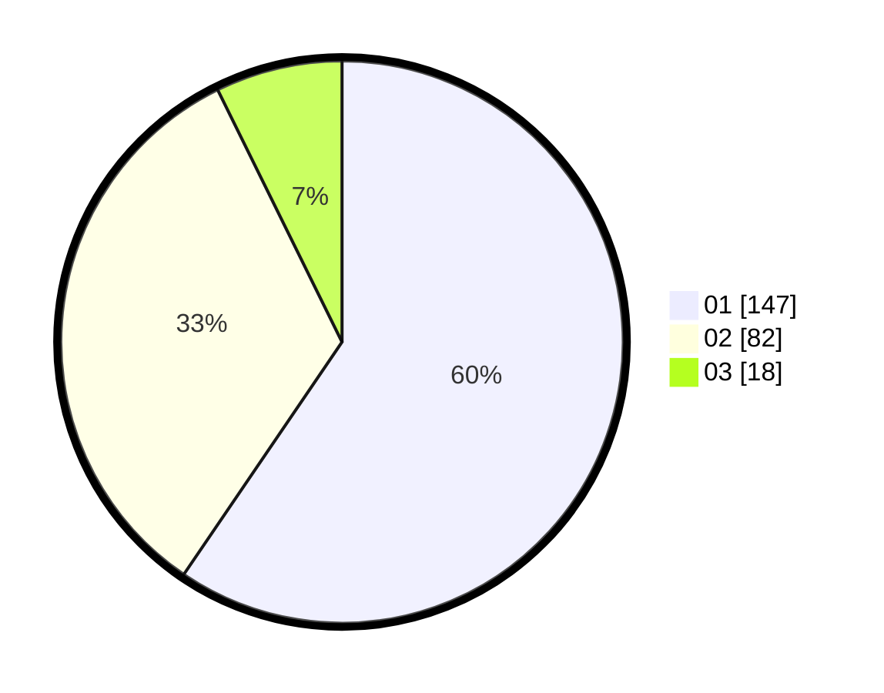

# Hasil

Hasil perolehan suara paslon dapat dilihat pada file paslon-01.txt, paslon-02.txt, dan paslon-03.txt.

Jika tidak ada, artinya data tersebut belum ada pada SIREKAP.

## Perolehan Suara

 * Paslon 01: **147**.
 * Paslon 02: **82**.
 * Paslon 03: **18**.

## Foto C Plano

https://sirekap-obj-formc.kpu.go.id/7ebd/pemilu/ppwp/31/75/04/10/04/3175041004047-20240214-202033--01f4dce4-4e1e-454e-b5f5-ae2a3f8dc5d2.jpg

https://sirekap-obj-formc.kpu.go.id/7ebd/pemilu/ppwp/31/75/04/10/04/3175041004047-20240214-202224--f917ae3f-4fad-4542-a793-faa2a4f9fcf0.jpg

https://sirekap-obj-formc.kpu.go.id/7ebd/pemilu/ppwp/31/75/04/10/04/3175041004047-20240214-202440--c23eef04-c459-4177-a546-07d62d6f27dc.jpg
