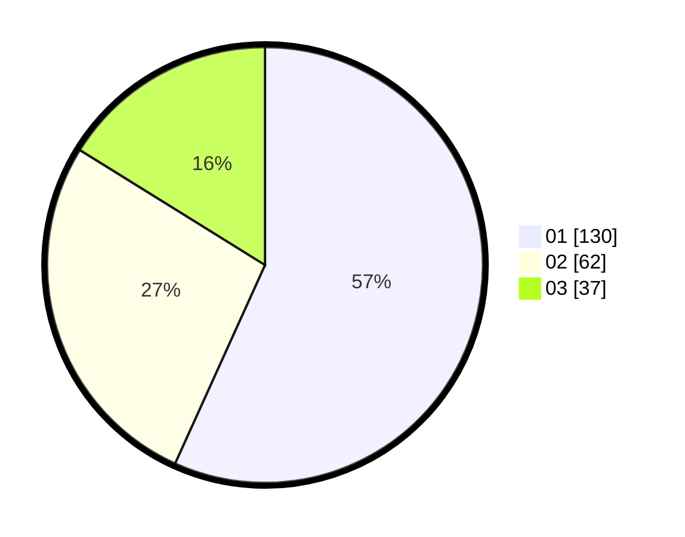

# Hasil

Hasil perolehan suara paslon dapat dilihat pada file paslon-01.txt, paslon-02.txt, dan paslon-03.txt.

Jika tidak ada, artinya data tersebut belum ada pada SIREKAP.

## Perolehan Suara

 * Paslon 01: **130**.
 * Paslon 02: **62**.
 * Paslon 03: **37**.

## Foto C Plano

https://sirekap-obj-formc.kpu.go.id/7f53/pemilu/ppwp/31/75/04/10/04/3175041004048-20240215-014001--4693f69d-46c7-492e-a7a3-b50b05ea61f4.jpg

https://sirekap-obj-formc.kpu.go.id/7f53/pemilu/ppwp/31/75/04/10/04/3175041004048-20240214-200311--0bc649ad-40a4-4b91-8177-d40f36a8e23b.jpg

https://sirekap-obj-formc.kpu.go.id/7f53/pemilu/ppwp/31/75/04/10/04/3175041004048-20240214-205720--5090af75-43bd-4bc2-941e-1a07abdde73b.jpg

## DATA PEMILIH TETAP

Jumlah pemilih dalam DPT: **271**.
 * L: **134**.
 * P: **137**.

## DATA PENGGUNA HAK PILIH

Jumlah pengguna hak pilih dalam DPT: **224**.
 * L: **112**.
 * P: **112**.

Jumlah pengguna hak pilih dalam DPTb: **4**.
 * L: **1**.
 * P: **3**.

Jumlah pengguna hak pilih dalam DPK: **3**.
 * L: **1**.
 * P: **2**.

Jumlah pengguna hak pilih: **231**.
 * L: **114**.
 * P: **117**.

## JUMLAH SUARA SAH DAN TIDAK SAH

JUMLAH SELURUH SUARA SAH: **229**.

JUMLAH SUARA TIDAK SAH: **2**.

JUMLAH SELURUH SUARA SAH DAN SUARA TIDAK SAH: **231**.
