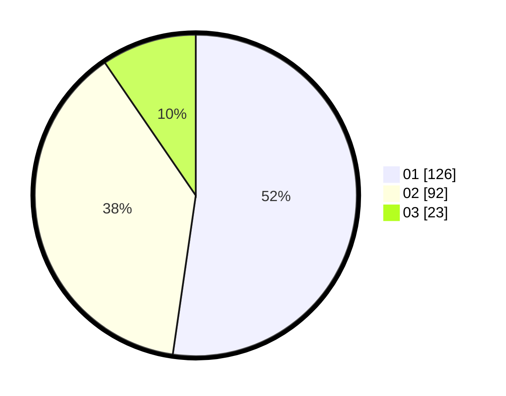

# Hasil

Hasil perolehan suara paslon dapat dilihat pada file paslon-01.txt, paslon-02.txt, dan paslon-03.txt.

Jika tidak ada, artinya data tersebut belum ada pada SIREKAP.

## Perolehan Suara

 * Paslon 01: **126**.
 * Paslon 02: **92**.
 * Paslon 03: **23**.

## Foto C Plano

https://sirekap-obj-formc.kpu.go.id/79f6/pemilu/ppwp/31/75/04/10/04/3175041004050-20240214-210002--70581a13-c86a-4d4c-9155-ab8393b314d0.jpg

https://sirekap-obj-formc.kpu.go.id/79f6/pemilu/ppwp/31/75/04/10/04/3175041004050-20240214-210257--8625adbd-b667-4611-bba5-e54b6cb606e0.jpg

https://sirekap-obj-formc.kpu.go.id/79f6/pemilu/ppwp/31/75/04/10/04/3175041004050-20240214-225014--d59fbf1d-436c-4cfc-89b7-efd83539b18f.jpg
