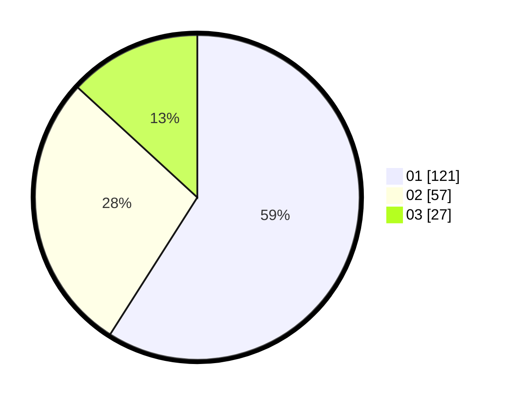

# Hasil

Hasil perolehan suara paslon dapat dilihat pada file paslon-01.txt, paslon-02.txt, dan paslon-03.txt.

Jika tidak ada, artinya data tersebut belum ada pada SIREKAP.

## Perolehan Suara

 * Paslon 01: **121**.
 * Paslon 02: **57**.
 * Paslon 03: **27**.

## Foto C Plano

https://sirekap-obj-formc.kpu.go.id/6560/pemilu/ppwp/31/75/04/10/04/3175041004059-20240216-142856--84ec1df6-de78-4531-aaab-bbc8e8b3d1a2.jpg

https://sirekap-obj-formc.kpu.go.id/6560/pemilu/ppwp/31/75/04/10/04/3175041004059-20240216-143421--26250275-bf8f-49b1-a55a-6b5e32327995.jpg

https://sirekap-obj-formc.kpu.go.id/6560/pemilu/ppwp/31/75/04/10/04/3175041004059-20240214-234126--2625b48e-fd6f-403f-8ad5-28b838dfc767.jpg

## DATA PEMILIH TETAP

Jumlah pemilih dalam DPT: **261**.
 * L: **121**.
 * P: **140**.

## DATA PENGGUNA HAK PILIH

Jumlah pengguna hak pilih dalam DPT: **189**.
 * L: **87**.
 * P: **102**.

Jumlah pengguna hak pilih dalam DPTb: **11**.
 * L: **3**.
 * P: **8**.

Jumlah pengguna hak pilih dalam DPK: **9**.
 * L: **3**.
 * P: **6**.

Jumlah pengguna hak pilih: **209**.
 * L: **93**.
 * P: **116**.

## JUMLAH SUARA SAH DAN TIDAK SAH

JUMLAH SELURUH SUARA SAH: **205**.

JUMLAH SUARA TIDAK SAH: **4**.

JUMLAH SELURUH SUARA SAH DAN SUARA TIDAK SAH: **209**.
