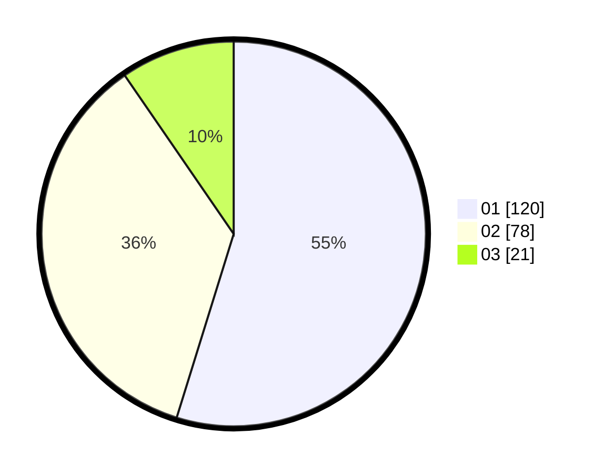

# Hasil

Hasil perolehan suara paslon dapat dilihat pada file paslon-01.txt, paslon-02.txt, dan paslon-03.txt.

Jika tidak ada, artinya data tersebut belum ada pada SIREKAP.

## Perolehan Suara

 * Paslon 01: **120**.
 * Paslon 02: **78**.
 * Paslon 03: **21**.

## Foto C Plano

https://sirekap-obj-formc.kpu.go.id/9ef1/pemilu/ppwp/31/75/04/10/04/3175041004064-20240214-155706--b8594b18-1b21-47e1-89a8-28e6136c5311.jpg

https://sirekap-obj-formc.kpu.go.id/9ef1/pemilu/ppwp/31/75/04/10/04/3175041004064-20240214-155734--4a9b991a-0afc-409d-bfe9-cc89231f5d38.jpg

https://sirekap-obj-formc.kpu.go.id/9ef1/pemilu/ppwp/31/75/04/10/04/3175041004064-20240214-155805--d1df91a3-5fa8-4832-9b44-a524f7ed24fd.jpg

## DATA PEMILIH TETAP

Jumlah pemilih dalam DPT: **280**.
 * L: **131**.
 * P: **149**.

## DATA PENGGUNA HAK PILIH

Jumlah pengguna hak pilih dalam DPT: **214**.
 * L: **106**.
 * P: **108**.

Jumlah pengguna hak pilih dalam DPTb: **1**.
 * L: **1**.
 * P: **0**.

Jumlah pengguna hak pilih dalam DPK: **6**.
 * L: **3**.
 * P: **3**.

Jumlah pengguna hak pilih: **221**.
 * L: **110**.
 * P: **111**.

## JUMLAH SUARA SAH DAN TIDAK SAH

JUMLAH SELURUH SUARA SAH: **217**.

JUMLAH SUARA TIDAK SAH: **4**.

JUMLAH SELURUH SUARA SAH DAN SUARA TIDAK SAH: **221**.
