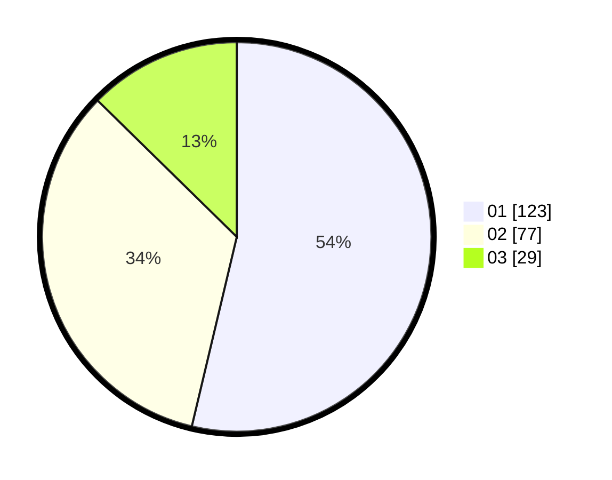

# Hasil

Hasil perolehan suara paslon dapat dilihat pada file paslon-01.txt, paslon-02.txt, dan paslon-03.txt.

Jika tidak ada, artinya data tersebut belum ada pada SIREKAP.

## Perolehan Suara

 * Paslon 01: **123**.
 * Paslon 02: **77**.
 * Paslon 03: **29**.

## Foto C Plano

https://sirekap-obj-formc.kpu.go.id/4ce7/pemilu/ppwp/31/75/04/10/04/3175041004065-20240214-212610--dfe91668-ae64-4813-b96e-d956e7f5a6a2.jpg

https://sirekap-obj-formc.kpu.go.id/4ce7/pemilu/ppwp/31/75/04/10/04/3175041004065-20240214-212712--29653a9f-4fc6-49ba-8953-d8266b5171f1.jpg

https://sirekap-obj-formc.kpu.go.id/4ce7/pemilu/ppwp/31/75/04/10/04/3175041004065-20240214-212815--52ee69e1-8078-48f5-b5c5-c8f82ed25cda.jpg

## DATA PEMILIH TETAP

Jumlah pemilih dalam DPT: **277**.
 * L: **144**.
 * P: **133**.

## DATA PENGGUNA HAK PILIH

Jumlah pengguna hak pilih dalam DPT: **225**.
 * L: **115**.
 * P: **110**.

Jumlah pengguna hak pilih dalam DPTb: **2**.
 * L: **1**.
 * P: **1**.

Jumlah pengguna hak pilih dalam DPK: **4**.
 * L: **2**.
 * P: **2**.

Jumlah pengguna hak pilih: **231**.
 * L: **118**.
 * P: **113**.

## JUMLAH SUARA SAH DAN TIDAK SAH

JUMLAH SELURUH SUARA SAH: **229**.

JUMLAH SUARA TIDAK SAH: **2**.

JUMLAH SELURUH SUARA SAH DAN SUARA TIDAK SAH: **231**.
