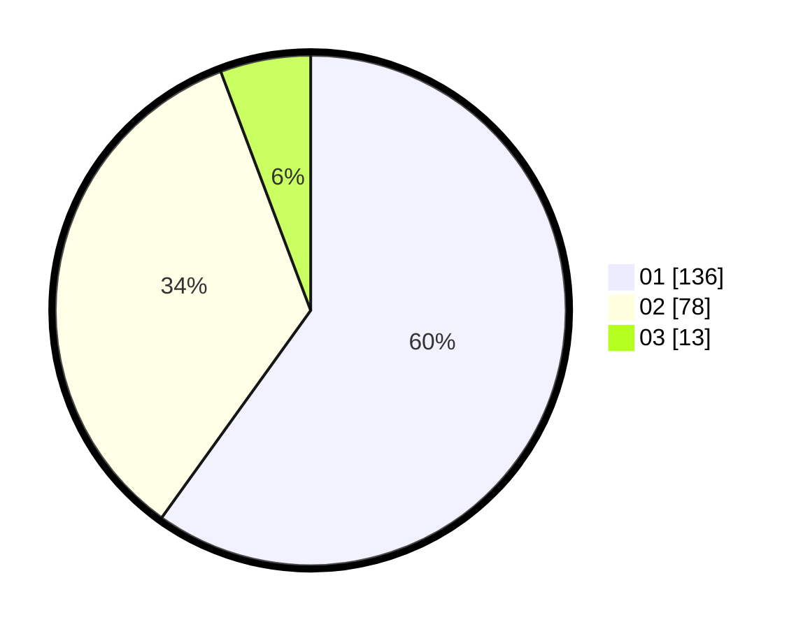

# Hasil

Hasil perolehan suara paslon dapat dilihat pada file paslon-01.txt, paslon-02.txt, dan paslon-03.txt.

Jika tidak ada, artinya data tersebut belum ada pada SIREKAP.

## Perolehan Suara

 * Paslon 01: **136**.
 * Paslon 02: **78**.
 * Paslon 03: **13**.

## Foto C Plano

https://sirekap-obj-formc.kpu.go.id/2536/pemilu/ppwp/31/75/04/10/04/3175041004069-20240214-225026--349792b3-0c4d-4992-a080-2cd807c00531.jpg

https://sirekap-obj-formc.kpu.go.id/2536/pemilu/ppwp/31/75/04/10/04/3175041004069-20240214-225136--d9022048-1713-4f5f-adbc-c504d5ac502a.jpg

https://sirekap-obj-formc.kpu.go.id/2536/pemilu/ppwp/31/75/04/10/04/3175041004069-20240214-225226--c3ec3141-2b9c-42e0-be15-e3a7081b5427.jpg
