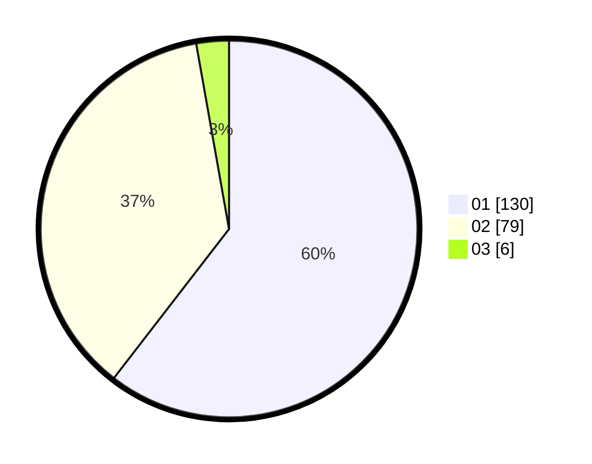

# Hasil

Hasil perolehan suara paslon dapat dilihat pada file paslon-01.txt, paslon-02.txt, dan paslon-03.txt.

Jika tidak ada, artinya data tersebut belum ada pada SIREKAP.

## Perolehan Suara

 * Paslon 01: **130**.
 * Paslon 02: **79**.
 * Paslon 03: **6**.

## Foto C Plano

https://sirekap-obj-formc.kpu.go.id/3c04/pemilu/ppwp/31/75/04/10/04/3175041004075-20240218-204858--8d982f15-4164-47a0-9a51-eccc3664610f.jpg

https://sirekap-obj-formc.kpu.go.id/3c04/pemilu/ppwp/31/75/04/10/04/3175041004075-20240218-205041--57e9405d-b0e0-4b6a-bb21-2604fdb27402.jpg
