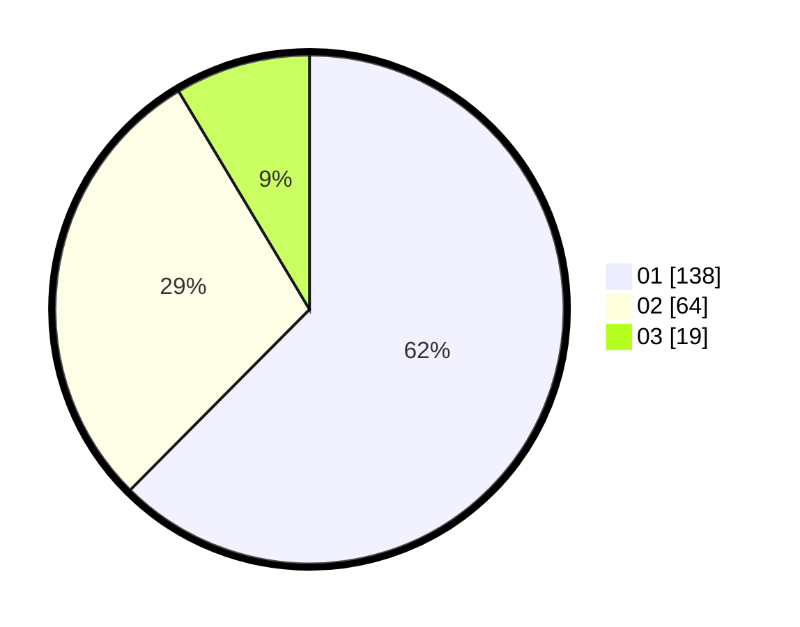

# Hasil

Hasil perolehan suara paslon dapat dilihat pada file paslon-01.txt, paslon-02.txt, dan paslon-03.txt.

Jika tidak ada, artinya data tersebut belum ada pada SIREKAP.

## Perolehan Suara

 * Paslon 01: **138**.
 * Paslon 02: **64**.
 * Paslon 03: **19**.

## Foto C Plano

https://sirekap-obj-formc.kpu.go.id/f3b3/pemilu/ppwp/31/75/04/10/04/3175041004076-20240215-103854--a31a68f5-be4c-4218-be98-a183ab212dcd.jpg

https://sirekap-obj-formc.kpu.go.id/f3b3/pemilu/ppwp/31/75/04/10/04/3175041004076-20240215-104332--9a16d811-df8d-4c27-8d95-799ba3e3686a.jpg
