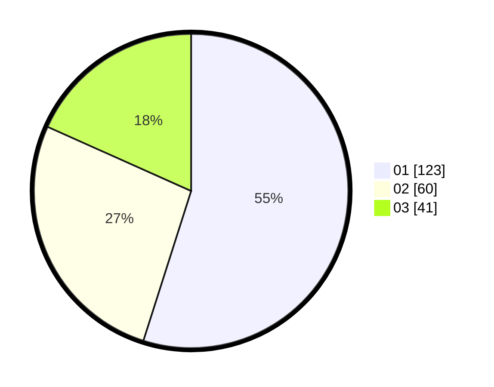

# Hasil

Hasil perolehan suara paslon dapat dilihat pada file paslon-01.txt, paslon-02.txt, dan paslon-03.txt.

Jika tidak ada, artinya data tersebut belum ada pada SIREKAP.

## Perolehan Suara

 * Paslon 01: **123**.
 * Paslon 02: **60**.
 * Paslon 03: **41**.

## Foto C Plano

https://sirekap-obj-formc.kpu.go.id/b556/pemilu/ppwp/31/75/04/10/04/3175041004077-20240216-150528--4457a90c-5267-4d86-b203-456ea7d103e5.jpg

https://sirekap-obj-formc.kpu.go.id/b556/pemilu/ppwp/31/75/04/10/04/3175041004077-20240216-150136--0de5b9ec-1dda-4fb1-bc6a-ac4d583f169f.jpg

https://sirekap-obj-formc.kpu.go.id/b556/pemilu/ppwp/31/75/04/10/04/3175041004077-20240216-150253--d5879523-ff9c-4387-b956-97d87ae51cf7.jpg
