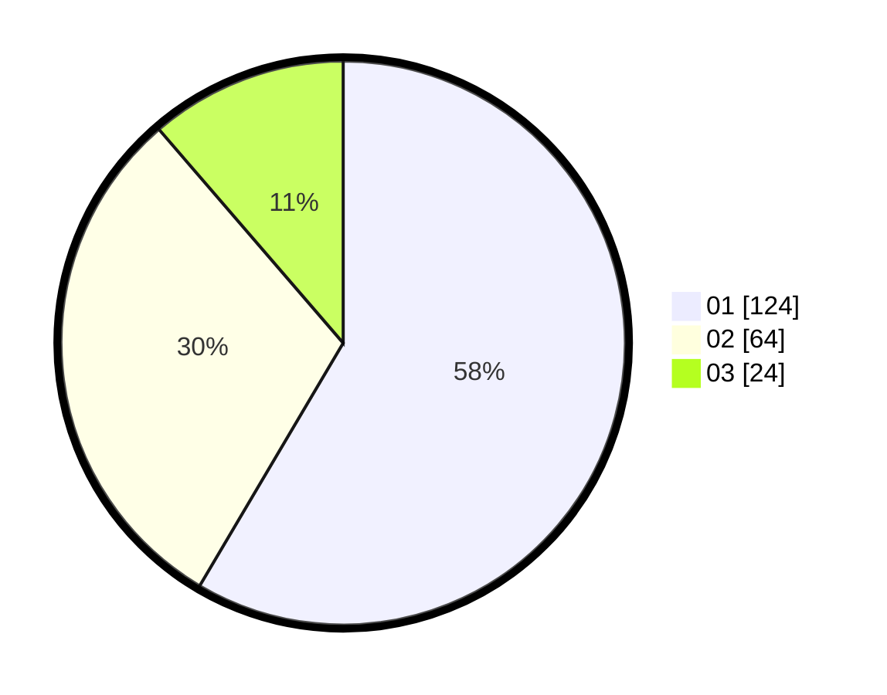

# Hasil

Hasil perolehan suara paslon dapat dilihat pada file paslon-01.txt, paslon-02.txt, dan paslon-03.txt.

Jika tidak ada, artinya data tersebut belum ada pada SIREKAP.

## Perolehan Suara

 * Paslon 01: **124**.
 * Paslon 02: **64**.
 * Paslon 03: **24**.

## Foto C Plano

https://sirekap-obj-formc.kpu.go.id/c0e4/pemilu/ppwp/31/75/04/10/04/3175041004086-20240214-212029--97f6ca17-66bb-40ca-86d8-4ab3d6685ffa.jpg

https://sirekap-obj-formc.kpu.go.id/c0e4/pemilu/ppwp/31/75/04/10/04/3175041004086-20240215-223831--49ac7abc-31c1-47ee-9f6a-08b0ba3538cd.jpg

https://sirekap-obj-formc.kpu.go.id/c0e4/pemilu/ppwp/31/75/04/10/04/3175041004086-20240215-175032--931501c3-c59b-48d1-9003-c9d84c382789.jpg

## DATA PEMILIH TETAP

Jumlah pemilih dalam DPT: **276**.
 * L: **134**.
 * P: **142**.

## DATA PENGGUNA HAK PILIH

Jumlah pengguna hak pilih dalam DPT: **220**.
 * L: **102**.
 * P: **118**.

Jumlah pengguna hak pilih dalam DPTb: **0**.
 * L: **0**.
 * P: **0**.

Jumlah pengguna hak pilih dalam DPK: **0**.
 * L: **0**.
 * P: **0**.

Jumlah pengguna hak pilih: **220**.
 * L: **102**.
 * P: **118**.

## JUMLAH SUARA SAH DAN TIDAK SAH

JUMLAH SELURUH SUARA SAH: **217**.

JUMLAH SUARA TIDAK SAH: **3**.

JUMLAH SELURUH SUARA SAH DAN SUARA TIDAK SAH: **220**.
