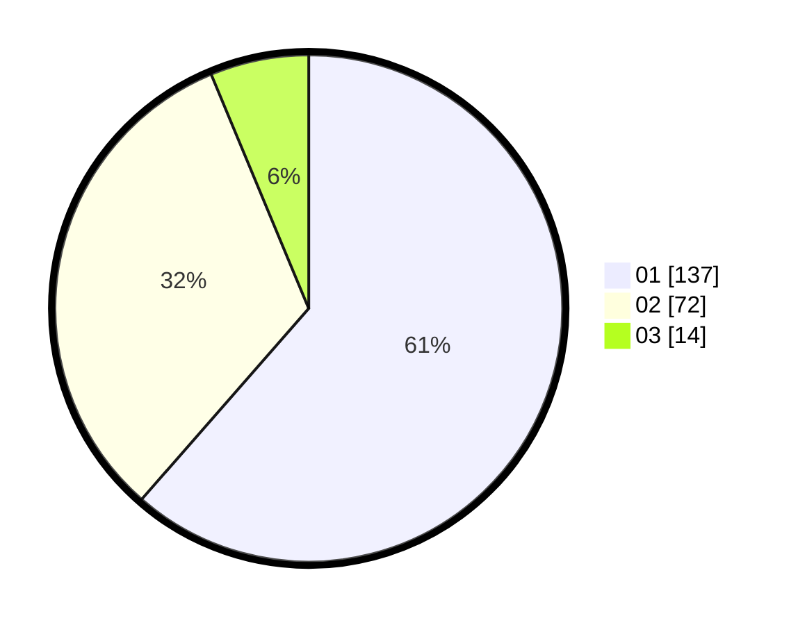

# Hasil

Hasil perolehan suara paslon dapat dilihat pada file paslon-01.txt, paslon-02.txt, dan paslon-03.txt.

Jika tidak ada, artinya data tersebut belum ada pada SIREKAP.

## Perolehan Suara

 * Paslon 01: **137**.
 * Paslon 02: **72**.
 * Paslon 03: **14**.

## Foto C Plano

https://sirekap-obj-formc.kpu.go.id/cc56/pemilu/ppwp/31/75/04/10/04/3175041004087-20240214-210948--0ad2673f-0f57-4323-9feb-c0988028d166.jpg

https://sirekap-obj-formc.kpu.go.id/cc56/pemilu/ppwp/31/75/04/10/04/3175041004087-20240214-211015--693e4b49-1f77-4975-a196-bb0a7ddfa8c0.jpg

https://sirekap-obj-formc.kpu.go.id/cc56/pemilu/ppwp/31/75/04/10/04/3175041004087-20240214-211047--e0dcde34-253a-4a11-979a-67ac0b188171.jpg
