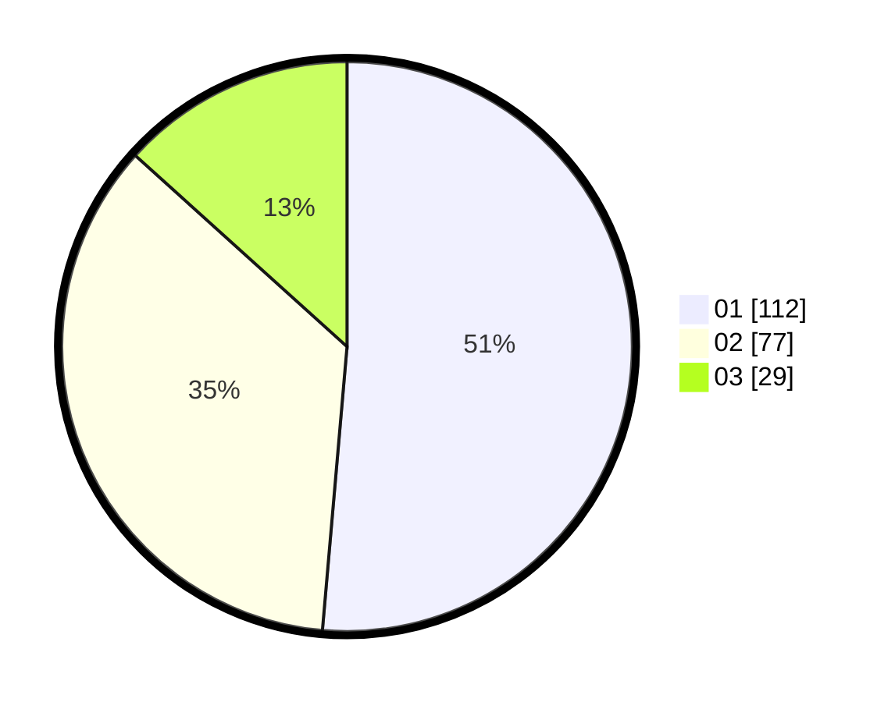

# Hasil

Hasil perolehan suara paslon dapat dilihat pada file paslon-01.txt, paslon-02.txt, dan paslon-03.txt.

Jika tidak ada, artinya data tersebut belum ada pada SIREKAP.

## Perolehan Suara

 * Paslon 01: **112**.
 * Paslon 02: **77**.
 * Paslon 03: **29**.

## Foto C Plano

https://sirekap-obj-formc.kpu.go.id/0176/pemilu/ppwp/31/75/04/10/04/3175041004088-20240215-014917--f2f39940-e5ae-48ba-849a-9b87f556f872.jpg

https://sirekap-obj-formc.kpu.go.id/0176/pemilu/ppwp/31/75/04/10/04/3175041004088-20240215-015137--8ae1ff96-2917-400b-bb88-e6a2c69644e5.jpg

https://sirekap-obj-formc.kpu.go.id/0176/pemilu/ppwp/31/75/04/10/04/3175041004088-20240215-015220--2f6f5a99-47b4-40c7-be89-387e6f027b40.jpg
