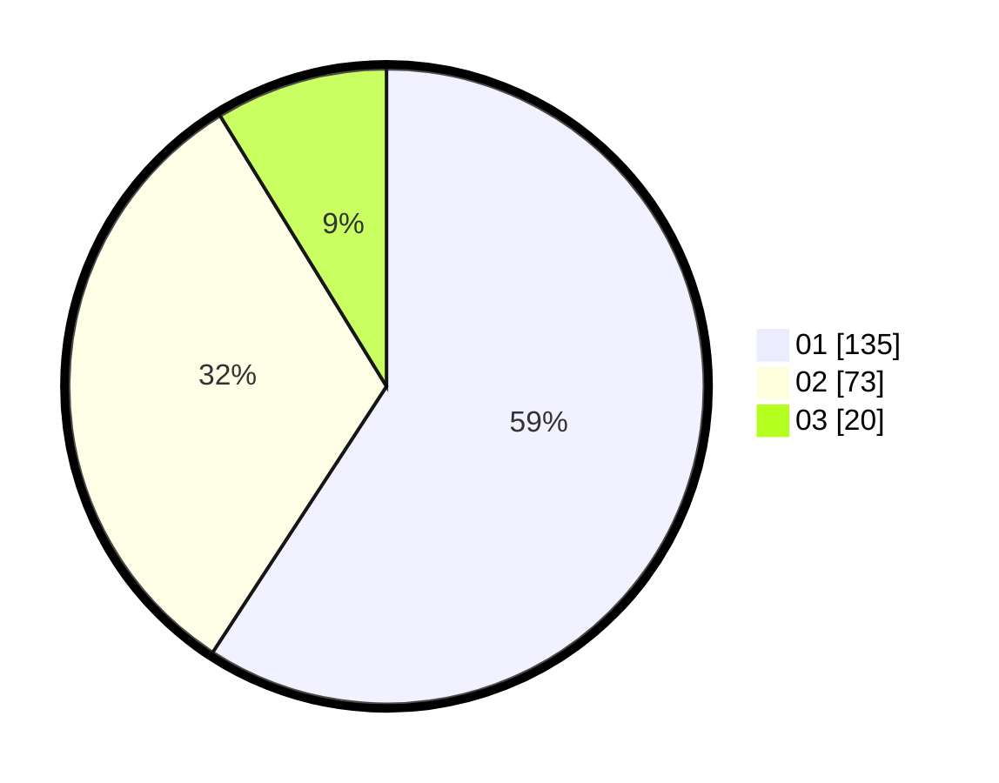

# Hasil

Hasil perolehan suara paslon dapat dilihat pada file paslon-01.txt, paslon-02.txt, dan paslon-03.txt.

Jika tidak ada, artinya data tersebut belum ada pada SIREKAP.

## Perolehan Suara

 * Paslon 01: **135**.
 * Paslon 02: **73**.
 * Paslon 03: **20**.

## Foto C Plano

https://sirekap-obj-formc.kpu.go.id/4fa6/pemilu/ppwp/31/75/04/10/04/3175041004089-20240214-203635--8868154e-1853-46a8-83b8-09142703b0db.jpg

https://sirekap-obj-formc.kpu.go.id/4fa6/pemilu/ppwp/31/75/04/10/04/3175041004089-20240214-204715--ae6706f8-0431-44f4-abcf-7dbd54625e89.jpg

https://sirekap-obj-formc.kpu.go.id/4fa6/pemilu/ppwp/31/75/04/10/04/3175041004089-20240214-204923--dcda1b29-c865-4d21-8cd7-94cf2cc1fb90.jpg
