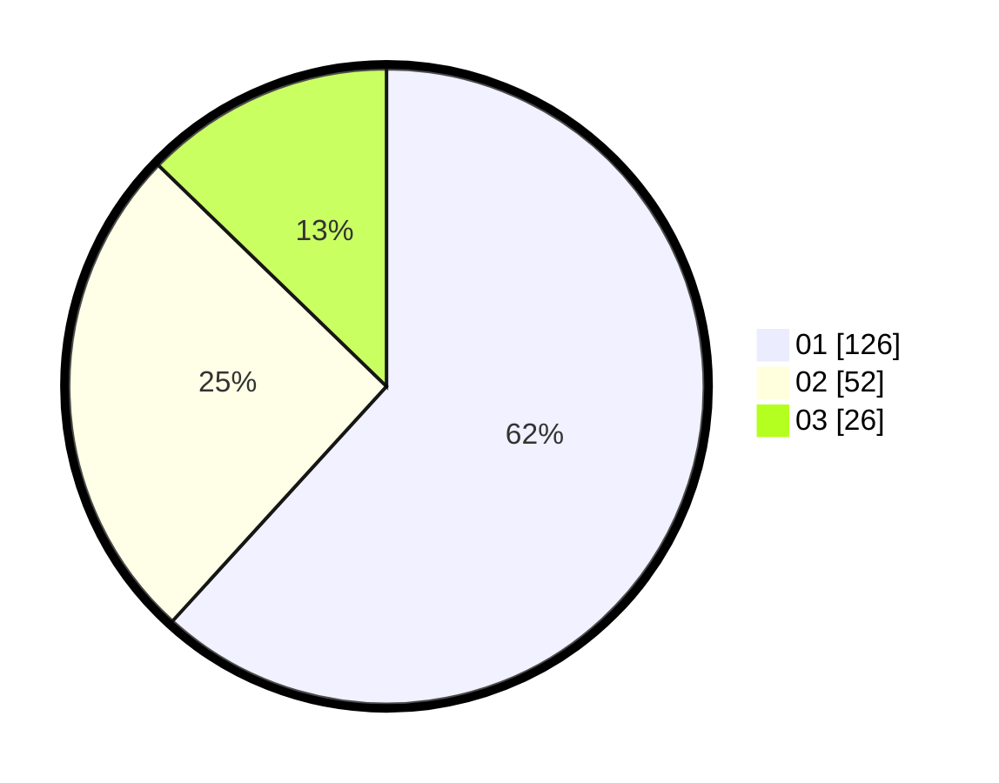

# Hasil

Hasil perolehan suara paslon dapat dilihat pada file paslon-01.txt, paslon-02.txt, dan paslon-03.txt.

Jika tidak ada, artinya data tersebut belum ada pada SIREKAP.

## Perolehan Suara

 * Paslon 01: **126**.
 * Paslon 02: **52**.
 * Paslon 03: **26**.

## Foto C Plano

https://sirekap-obj-formc.kpu.go.id/ecbd/pemilu/ppwp/31/75/04/10/04/3175041004093-20240214-212718--6b66fb2d-20c8-4088-b34d-1c25ac1f6043.jpg

https://sirekap-obj-formc.kpu.go.id/ecbd/pemilu/ppwp/31/75/04/10/04/3175041004093-20240214-214045--0cc2a03b-fa11-4115-bebc-fa41c3dfbf33.jpg

https://sirekap-obj-formc.kpu.go.id/ecbd/pemilu/ppwp/31/75/04/10/04/3175041004093-20240214-214246--75f90ac6-c823-414c-b322-e55af1cb7f2d.jpg
