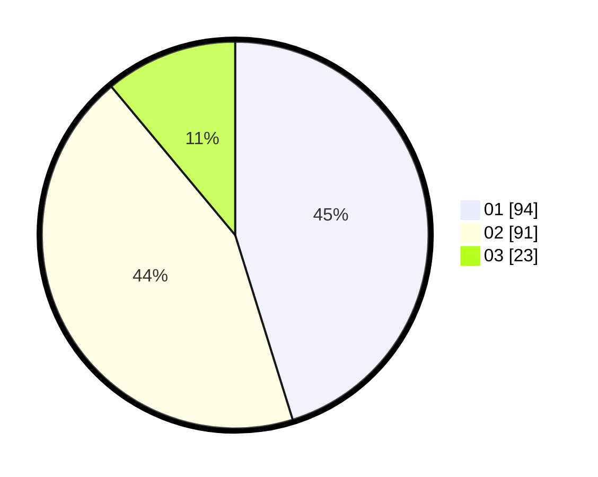

# Hasil

Hasil perolehan suara paslon dapat dilihat pada file paslon-01.txt, paslon-02.txt, dan paslon-03.txt.

Jika tidak ada, artinya data tersebut belum ada pada SIREKAP.

## Perolehan Suara

 * Paslon 01: **94**.
 * Paslon 02: **91**.
 * Paslon 03: **23**.

## Foto C Plano

https://sirekap-obj-formc.kpu.go.id/a54b/pemilu/ppwp/31/75/04/10/04/3175041004097-20240215-044410--dbd9b602-97fa-49cb-a0de-0e41ca253317.jpg

https://sirekap-obj-formc.kpu.go.id/a54b/pemilu/ppwp/31/75/04/10/04/3175041004097-20240215-024709--7a656be3-0336-45a7-b3d8-e40fc2ba96b3.jpg

https://sirekap-obj-formc.kpu.go.id/a54b/pemilu/ppwp/31/75/04/10/04/3175041004097-20240215-044704--a1c1140f-62e6-4534-8c7b-61266ff554f1.jpg
