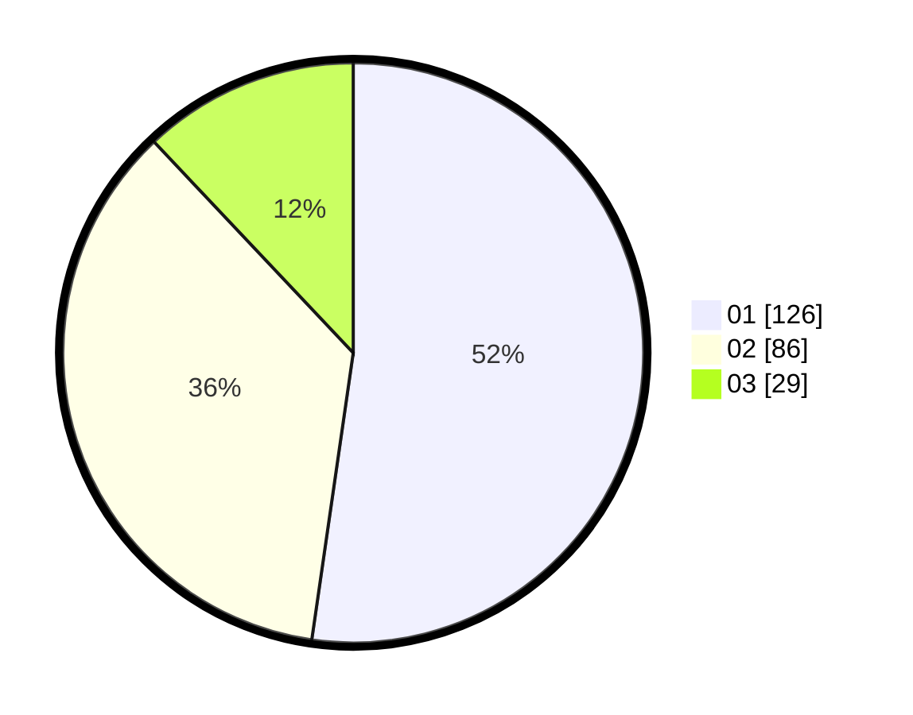

# Hasil

Hasil perolehan suara paslon dapat dilihat pada file paslon-01.txt, paslon-02.txt, dan paslon-03.txt.

Jika tidak ada, artinya data tersebut belum ada pada SIREKAP.

## Perolehan Suara

 * Paslon 01: **126**.
 * Paslon 02: **86**.
 * Paslon 03: **29**.

## Foto C Plano

https://sirekap-obj-formc.kpu.go.id/2128/pemilu/ppwp/31/75/04/10/04/3175041004099-20240216-143039--a640fe2a-4891-4f00-ae42-11ccc889a233.jpg

https://sirekap-obj-formc.kpu.go.id/2128/pemilu/ppwp/31/75/04/10/04/3175041004099-20240216-143040--21980ed4-3f4e-42a2-b82e-dbcb95808ca8.jpg

https://sirekap-obj-formc.kpu.go.id/2128/pemilu/ppwp/31/75/04/10/04/3175041004099-20240216-143040--8a8c3e34-d696-4226-8f52-6e5a6a571b98.jpg

## DATA PEMILIH TETAP

Jumlah pemilih dalam DPT: **291**.
 * L: **136**.
 * P: **155**.

## DATA PENGGUNA HAK PILIH

Jumlah pengguna hak pilih dalam DPT: **237**.
 * L: **104**.
 * P: **133**.

Jumlah pengguna hak pilih dalam DPTb: **2**.
 * L: **1**.
 * P: **1**.

Jumlah pengguna hak pilih dalam DPK: **3**.
 * L: **3**.
 * P: **0**.

Jumlah pengguna hak pilih: **242**.
 * L: **108**.
 * P: **134**.

## JUMLAH SUARA SAH DAN TIDAK SAH

JUMLAH SELURUH SUARA SAH: **241**.

JUMLAH SUARA TIDAK SAH: **1**.

JUMLAH SELURUH SUARA SAH DAN SUARA TIDAK SAH: **242**.
