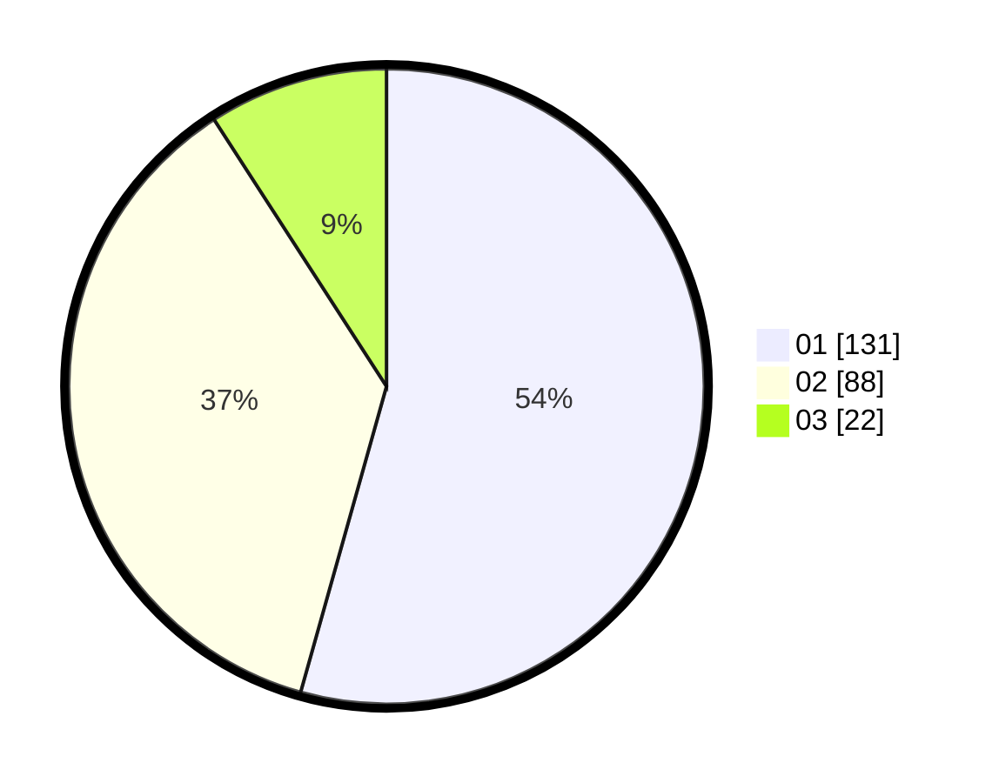

# Hasil

Hasil perolehan suara paslon dapat dilihat pada file paslon-01.txt, paslon-02.txt, dan paslon-03.txt.

Jika tidak ada, artinya data tersebut belum ada pada SIREKAP.

## Perolehan Suara

 * Paslon 01: **131**.
 * Paslon 02: **88**.
 * Paslon 03: **22**.

## Foto C Plano

https://sirekap-obj-formc.kpu.go.id/5d4b/pemilu/ppwp/31/75/04/10/04/3175041004100-20240214-215440--4cd06271-f3ac-4b44-ac18-c13c9fbda7d1.jpg

https://sirekap-obj-formc.kpu.go.id/5d4b/pemilu/ppwp/31/75/04/10/04/3175041004100-20240216-065051--50bbd875-c980-47f2-b1d2-d0b97db55cd5.jpg

https://sirekap-obj-formc.kpu.go.id/5d4b/pemilu/ppwp/31/75/04/10/04/3175041004100-20240216-065057--6bfca58a-8742-4d86-a4a8-29563a55909c.jpg

## DATA PEMILIH TETAP

Jumlah pemilih dalam DPT: **293**.
 * L: **142**.
 * P: **151**.

## DATA PENGGUNA HAK PILIH

Jumlah pengguna hak pilih dalam DPT: **238**.
 * L: **111**.
 * P: **127**.

Jumlah pengguna hak pilih dalam DPTb: **8**.
 * L: **4**.
 * P: **4**.

Jumlah pengguna hak pilih dalam DPK: **1**.
 * L: **1**.
 * P: **0**.

Jumlah pengguna hak pilih: **247**.
 * L: **116**.
 * P: **131**.

## JUMLAH SUARA SAH DAN TIDAK SAH

JUMLAH SELURUH SUARA SAH: **241**.

JUMLAH SUARA TIDAK SAH: **6**.

JUMLAH SELURUH SUARA SAH DAN SUARA TIDAK SAH: **247**.
