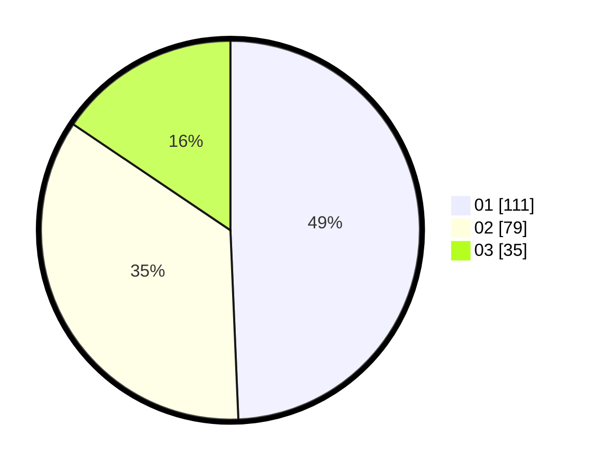

# Hasil

Hasil perolehan suara paslon dapat dilihat pada file paslon-01.txt, paslon-02.txt, dan paslon-03.txt.

Jika tidak ada, artinya data tersebut belum ada pada SIREKAP.

## Perolehan Suara

 * Paslon 01: **111**.
 * Paslon 02: **79**.
 * Paslon 03: **35**.

## Foto C Plano

https://sirekap-obj-formc.kpu.go.id/9880/pemilu/ppwp/31/75/04/10/04/3175041004103-20240218-195310--481c389d-f57c-4452-a37c-91773cf7438a.jpg

https://sirekap-obj-formc.kpu.go.id/9880/pemilu/ppwp/31/75/04/10/04/3175041004103-20240218-212259--4d938b5d-6bf8-4975-ab56-b77ed193d552.jpg

https://sirekap-obj-formc.kpu.go.id/9880/pemilu/ppwp/31/75/04/10/04/3175041004103-20240218-195315--8c58b8bd-f89d-45d6-9a27-572ef4d4ef2f.jpg

## DATA PEMILIH TETAP

Jumlah pemilih dalam DPT: **278**.
 * L: **152**.
 * P: **126**.

## DATA PENGGUNA HAK PILIH

Jumlah pengguna hak pilih dalam DPT: **223**.
 * L: **123**.
 * P: **100**.

Jumlah pengguna hak pilih dalam DPTb: **2**.
 * L: **0**.
 * P: **2**.

Jumlah pengguna hak pilih dalam DPK: **2**.
 * L: **0**.
 * P: **2**.

Jumlah pengguna hak pilih: **227**.
 * L: **123**.
 * P: **104**.

## JUMLAH SUARA SAH DAN TIDAK SAH

JUMLAH SELURUH SUARA SAH: **225**.

JUMLAH SUARA TIDAK SAH: **2**.

JUMLAH SELURUH SUARA SAH DAN SUARA TIDAK SAH: **227**.
