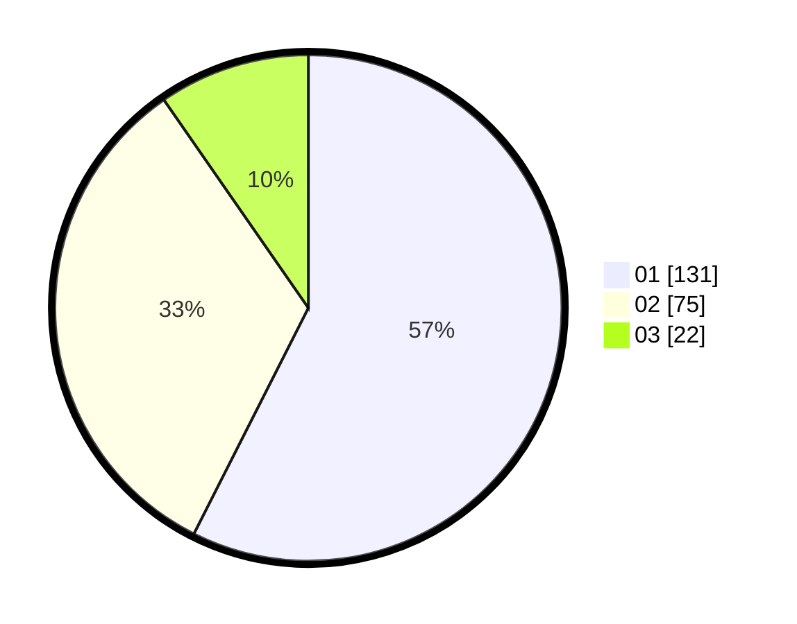

# Hasil

Hasil perolehan suara paslon dapat dilihat pada file paslon-01.txt, paslon-02.txt, dan paslon-03.txt.

Jika tidak ada, artinya data tersebut belum ada pada SIREKAP.

## Perolehan Suara

 * Paslon 01: **131**.
 * Paslon 02: **75**.
 * Paslon 03: **22**.

## Foto C Plano

https://sirekap-obj-formc.kpu.go.id/86c5/pemilu/ppwp/31/75/04/10/04/3175041004107-20240216-081855--e1c593f8-9490-4512-9858-77bcc629f56b.jpg

https://sirekap-obj-formc.kpu.go.id/86c5/pemilu/ppwp/31/75/04/10/04/3175041004107-20240214-155243--7fa53bc1-43df-46c8-a8e6-245ae63cd82f.jpg

https://sirekap-obj-formc.kpu.go.id/86c5/pemilu/ppwp/31/75/04/10/04/3175041004107-20240216-081856--f9b2f97c-06d1-4b5d-9a23-d03b0fa2cfea.jpg

## DATA PEMILIH TETAP

Jumlah pemilih dalam DPT: **229**.
 * L: **117**.
 * P: **112**.

## DATA PENGGUNA HAK PILIH

Jumlah pengguna hak pilih dalam DPT: **272**.
 * L: **137**.
 * P: **135**.

Jumlah pengguna hak pilih dalam DPTb: **2**.
 * L: **1**.
 * P: **1**.

Jumlah pengguna hak pilih dalam DPK: **0**.
 * L: **0**.
 * P: **0**.

Jumlah pengguna hak pilih: **274**.
 * L: **138**.
 * P: **136**.

## JUMLAH SUARA SAH DAN TIDAK SAH

JUMLAH SELURUH SUARA SAH: **228**.

JUMLAH SUARA TIDAK SAH: **1**.

JUMLAH SELURUH SUARA SAH DAN SUARA TIDAK SAH: **229**.
