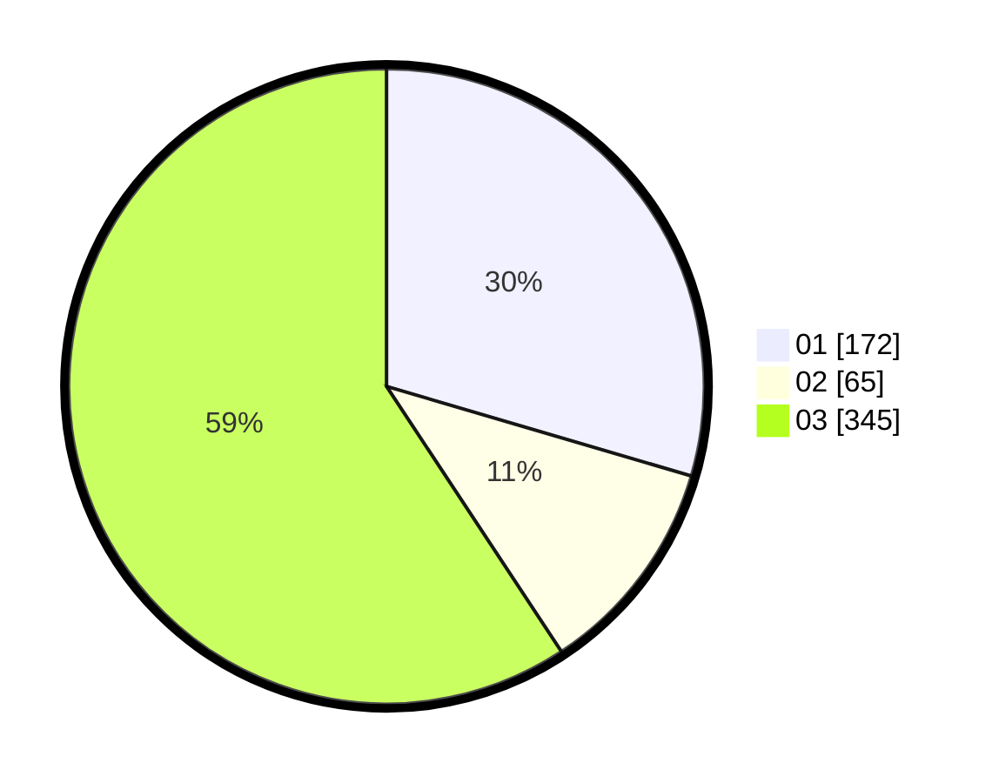

# Hasil

Hasil perolehan suara paslon dapat dilihat pada file paslon-01.txt, paslon-02.txt, dan paslon-03.txt.

Jika tidak ada, artinya data tersebut belum ada pada SIREKAP.

## Perolehan Suara

 * Paslon 01: **172**.
 * Paslon 02: **65**.
 * Paslon 03: **345**.

## Foto C Plano

https://sirekap-obj-formc.kpu.go.id/453b/pemilu/ppwp/31/75/04/10/04/3175041004109-20240214-231209--33217265-daf4-433d-8ce8-42b99ae13b7c.jpg

https://sirekap-obj-formc.kpu.go.id/453b/pemilu/ppwp/31/75/04/10/04/3175041004109-20240218-101826--494729b2-4410-4ed2-9e25-0a63f63d798d.jpg

https://sirekap-obj-formc.kpu.go.id/453b/pemilu/ppwp/31/75/04/10/04/3175041004109-20240214-232258--d8b0ed8b-56bd-47d4-be00-0cefd3c038d9.jpg

## DATA PEMILIH TETAP

Jumlah pemilih dalam DPT: **289**.
 * L: **142**.
 * P: **147**.

## DATA PENGGUNA HAK PILIH

Jumlah pengguna hak pilih dalam DPT: **237**.
 * L: **114**.
 * P: **123**.

Jumlah pengguna hak pilih dalam DPTb: **5**.
 * L: **1**.
 * P: **4**.

Jumlah pengguna hak pilih dalam DPK: **5**.
 * L: **1**.
 * P: **4**.

Jumlah pengguna hak pilih: **247**.
 * L: **116**.
 * P: **131**.

## JUMLAH SUARA SAH DAN TIDAK SAH

JUMLAH SELURUH SUARA SAH: **242**.

JUMLAH SUARA TIDAK SAH: **5**.

JUMLAH SELURUH SUARA SAH DAN SUARA TIDAK SAH: **247**.
