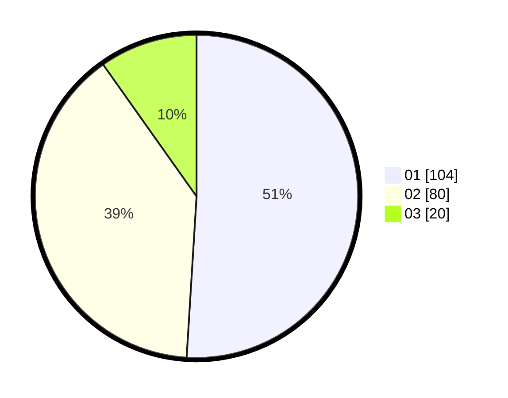

# Hasil

Hasil perolehan suara paslon dapat dilihat pada file paslon-01.txt, paslon-02.txt, dan paslon-03.txt.

Jika tidak ada, artinya data tersebut belum ada pada SIREKAP.

## Perolehan Suara

 * Paslon 01: **104**.
 * Paslon 02: **80**.
 * Paslon 03: **20**.

## Foto C Plano

https://sirekap-obj-formc.kpu.go.id/7432/pemilu/ppwp/31/75/04/10/04/3175041004115-20240214-195520--e438fca0-bbc1-40c2-b2f0-d291079c2023.jpg

https://sirekap-obj-formc.kpu.go.id/7432/pemilu/ppwp/31/75/04/10/04/3175041004115-20240214-195541--be96e8e0-7738-4d3f-8a51-c7cd70a8c46d.jpg

https://sirekap-obj-formc.kpu.go.id/7432/pemilu/ppwp/31/75/04/10/04/3175041004115-20240214-195549--17e4cc10-6acf-4c47-9fcf-534348ee8aac.jpg

## DATA PEMILIH TETAP

Jumlah pemilih dalam DPT: **273**.
 * L: **139**.
 * P: **134**.

## DATA PENGGUNA HAK PILIH

Jumlah pengguna hak pilih dalam DPT: **209**.
 * L: **99**.
 * P: **110**.

Jumlah pengguna hak pilih dalam DPTb: **0**.
 * L: **0**.
 * P: **0**.

Jumlah pengguna hak pilih dalam DPK: **0**.
 * L: **0**.
 * P: **0**.

Jumlah pengguna hak pilih: **209**.
 * L: **99**.
 * P: **110**.

## JUMLAH SUARA SAH DAN TIDAK SAH

JUMLAH SELURUH SUARA SAH: **204**.

JUMLAH SUARA TIDAK SAH: **5**.

JUMLAH SELURUH SUARA SAH DAN SUARA TIDAK SAH: **209**.
