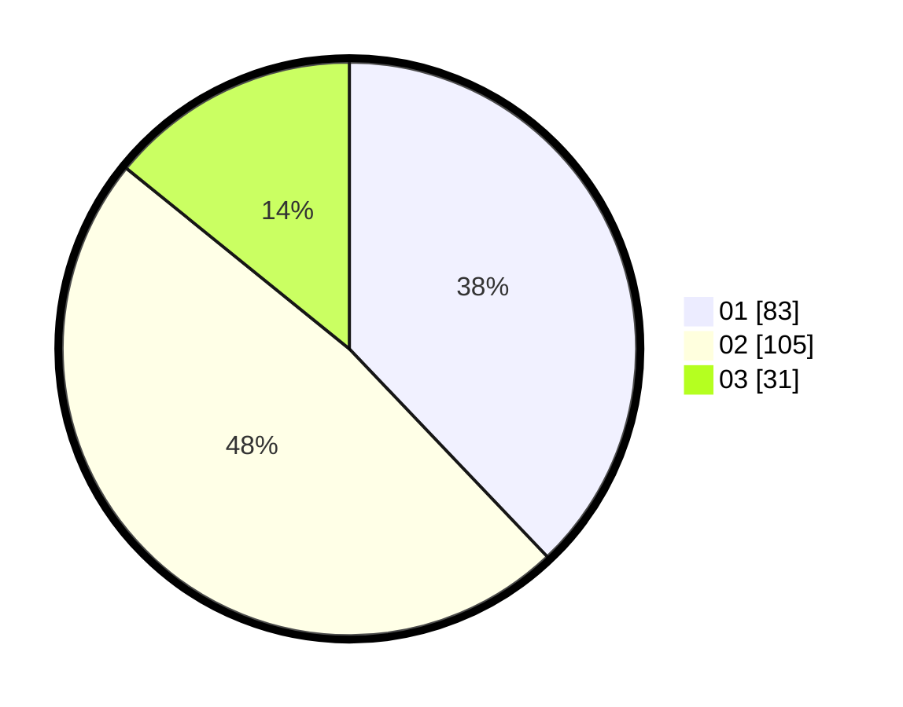

# Hasil

Hasil perolehan suara paslon dapat dilihat pada file paslon-01.txt, paslon-02.txt, dan paslon-03.txt.

Jika tidak ada, artinya data tersebut belum ada pada SIREKAP.

## Perolehan Suara

 * Paslon 01: **83**.
 * Paslon 02: **105**.
 * Paslon 03: **31**.

## Foto C Plano

https://sirekap-obj-formc.kpu.go.id/8e2d/pemilu/ppwp/31/75/04/10/04/3175041004117-20240214-210646--fecc8bab-3297-4048-8b0a-29339287d313.jpg

https://sirekap-obj-formc.kpu.go.id/8e2d/pemilu/ppwp/31/75/04/10/04/3175041004117-20240214-210740--f7b485d6-16fa-49f6-9663-67949a7d3c8c.jpg
