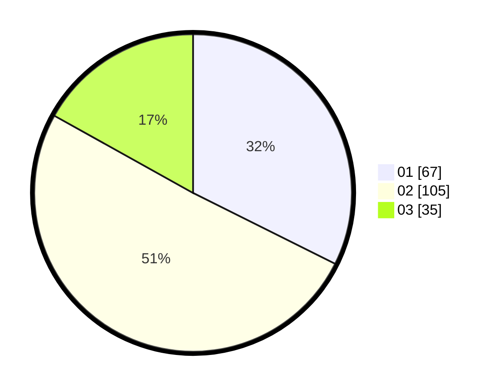

# Hasil

Hasil perolehan suara paslon dapat dilihat pada file paslon-01.txt, paslon-02.txt, dan paslon-03.txt.

Jika tidak ada, artinya data tersebut belum ada pada SIREKAP.

## Perolehan Suara

 * Paslon 01: **67**.
 * Paslon 02: **105**.
 * Paslon 03: **35**.

## Foto C Plano

https://sirekap-obj-formc.kpu.go.id/ec32/pemilu/ppwp/31/75/04/10/04/3175041004119-20240214-205130--68e0bd8a-8921-4875-8a46-1dc71ab575d4.jpg

https://sirekap-obj-formc.kpu.go.id/ec32/pemilu/ppwp/31/75/04/10/04/3175041004119-20240214-205151--780c3b90-081c-4c4d-bc87-ce1a8180350b.jpg

https://sirekap-obj-formc.kpu.go.id/ec32/pemilu/ppwp/31/75/04/10/04/3175041004119-20240214-205208--681c4618-124f-4b42-86aa-5230e0d4f7fb.jpg

## DATA PEMILIH TETAP

Jumlah pemilih dalam DPT: **293**.
 * L: **140**.
 * P: **153**.

## DATA PENGGUNA HAK PILIH

Jumlah pengguna hak pilih dalam DPT: **207**.
 * L: **95**.
 * P: **112**.

Jumlah pengguna hak pilih dalam DPTb: **0**.
 * L: **0**.
 * P: **0**.

Jumlah pengguna hak pilih dalam DPK: **2**.
 * L: **1**.
 * P: **1**.

Jumlah pengguna hak pilih: **209**.
 * L: **96**.
 * P: **113**.

## JUMLAH SUARA SAH DAN TIDAK SAH

JUMLAH SELURUH SUARA SAH: **207**.

JUMLAH SUARA TIDAK SAH: **2**.

JUMLAH SELURUH SUARA SAH DAN SUARA TIDAK SAH: **209**.
