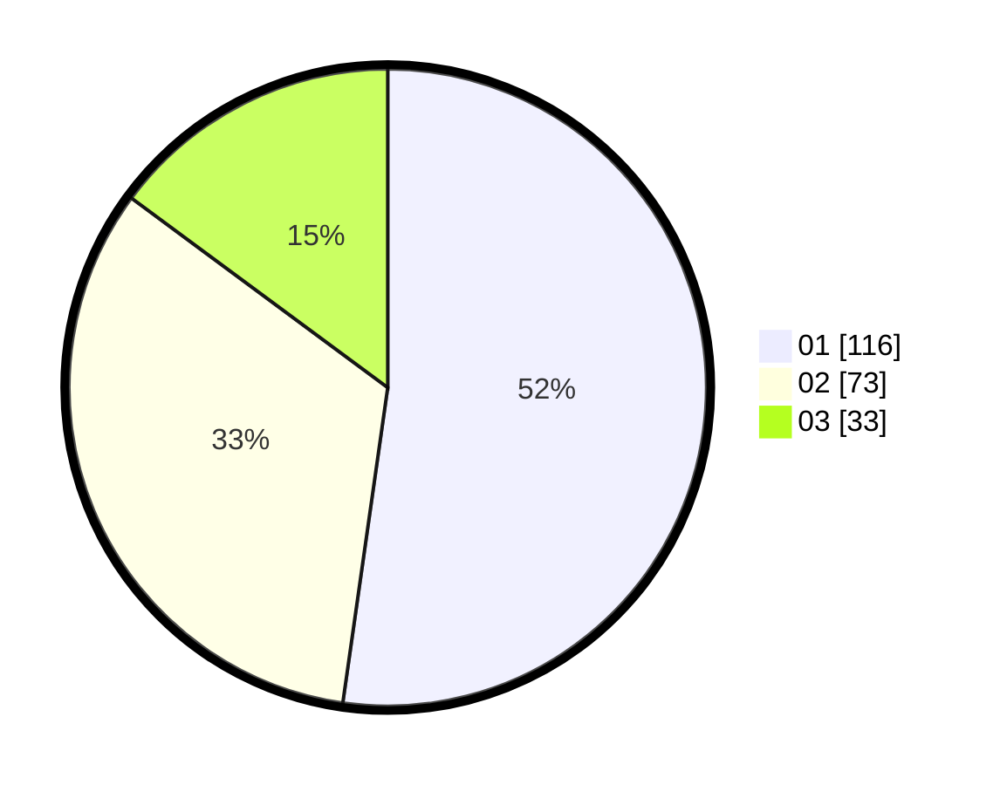

# Hasil

Hasil perolehan suara paslon dapat dilihat pada file paslon-01.txt, paslon-02.txt, dan paslon-03.txt.

Jika tidak ada, artinya data tersebut belum ada pada SIREKAP.

## Perolehan Suara

 * Paslon 01: **116**.
 * Paslon 02: **73**.
 * Paslon 03: **33**.

## Foto C Plano

https://sirekap-obj-formc.kpu.go.id/9e76/pemilu/ppwp/31/75/04/10/04/3175041004122-20240215-003419--6c518525-2e67-4f8c-861f-bfb860e3ad99.jpg

https://sirekap-obj-formc.kpu.go.id/9e76/pemilu/ppwp/31/75/04/10/04/3175041004122-20240215-003526--ad6af50d-4073-447b-bbd9-5cd54c98be38.jpg

https://sirekap-obj-formc.kpu.go.id/9e76/pemilu/ppwp/31/75/04/10/04/3175041004122-20240215-003608--6d939a05-17c8-42d0-a0f6-e9359e9c654e.jpg
