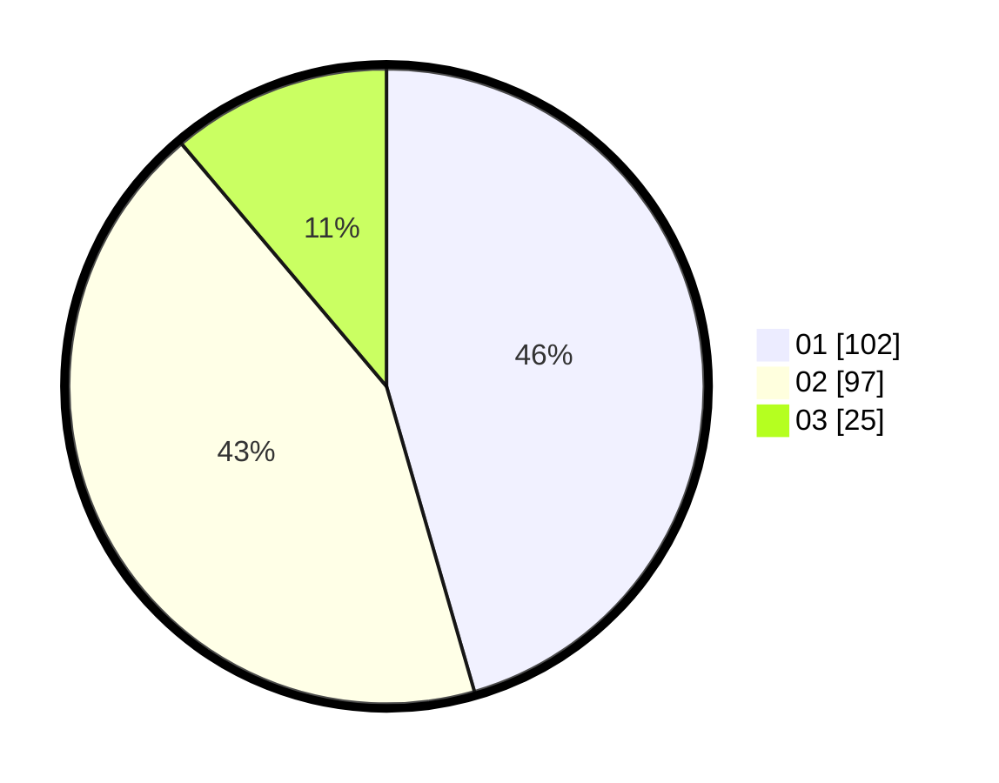

# Hasil

Hasil perolehan suara paslon dapat dilihat pada file paslon-01.txt, paslon-02.txt, dan paslon-03.txt.

Jika tidak ada, artinya data tersebut belum ada pada SIREKAP.

## Perolehan Suara

 * Paslon 01: **102**.
 * Paslon 02: **97**.
 * Paslon 03: **25**.

## Foto C Plano

https://sirekap-obj-formc.kpu.go.id/c0df/pemilu/ppwp/31/75/04/10/04/3175041004127-20240215-220309--0628492c-6055-4999-b6b1-623a659ebbba.jpg

https://sirekap-obj-formc.kpu.go.id/c0df/pemilu/ppwp/31/75/04/10/04/3175041004127-20240215-220318--17711e8b-8ae6-4130-bc5e-80165129c95e.jpg

https://sirekap-obj-formc.kpu.go.id/c0df/pemilu/ppwp/31/75/04/10/04/3175041004127-20240215-220349--43f416ff-42f2-4fe3-aa8b-5db148a7c15d.jpg
