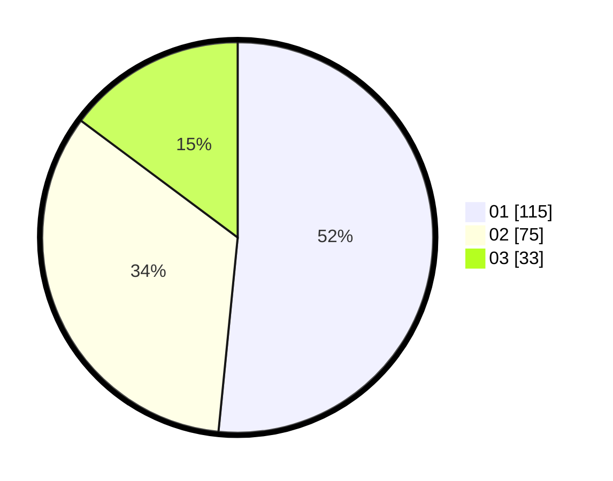

# Hasil

Hasil perolehan suara paslon dapat dilihat pada file paslon-01.txt, paslon-02.txt, dan paslon-03.txt.

Jika tidak ada, artinya data tersebut belum ada pada SIREKAP.

## Perolehan Suara

 * Paslon 01: **115**.
 * Paslon 02: **75**.
 * Paslon 03: **33**.

## Foto C Plano

https://sirekap-obj-formc.kpu.go.id/78bf/pemilu/ppwp/31/75/04/10/04/3175041004129-20240215-144326--ed3a2752-2439-41c6-a62e-b014299155f5.jpg

https://sirekap-obj-formc.kpu.go.id/78bf/pemilu/ppwp/31/75/04/10/04/3175041004129-20240215-144138--fcb8b40e-93bb-4498-801c-f012237cea59.jpg

https://sirekap-obj-formc.kpu.go.id/78bf/pemilu/ppwp/31/75/04/10/04/3175041004129-20240215-144528--d2a8299a-0458-4b85-8040-a41009337915.jpg
