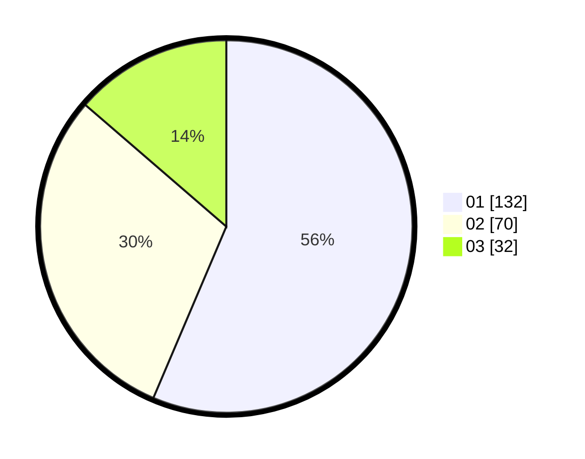

# Hasil

Hasil perolehan suara paslon dapat dilihat pada file paslon-01.txt, paslon-02.txt, dan paslon-03.txt.

Jika tidak ada, artinya data tersebut belum ada pada SIREKAP.

## Perolehan Suara

 * Paslon 01: **132**.
 * Paslon 02: **70**.
 * Paslon 03: **32**.

## Foto C Plano

https://sirekap-obj-formc.kpu.go.id/d422/pemilu/ppwp/31/75/04/10/04/3175041004134-20240214-155456--f15756e0-992c-406e-88e4-330fdfde8bb4.jpg

https://sirekap-obj-formc.kpu.go.id/d422/pemilu/ppwp/31/75/04/10/04/3175041004134-20240214-155517--7ce07baa-ed39-4e9d-a8ef-23b8dfd957a9.jpg

https://sirekap-obj-formc.kpu.go.id/d422/pemilu/ppwp/31/75/04/10/04/3175041004134-20240214-155522--6dba04f2-8dd8-4a60-9c22-5987fccf53f3.jpg

## DATA PEMILIH TETAP

Jumlah pemilih dalam DPT: **276**.
 * L: **125**.
 * P: **151**.

## DATA PENGGUNA HAK PILIH

Jumlah pengguna hak pilih dalam DPT: **227**.
 * L: **106**.
 * P: **121**.

Jumlah pengguna hak pilih dalam DPTb: **2**.
 * L: **0**.
 * P: **2**.

Jumlah pengguna hak pilih dalam DPK: **8**.
 * L: **5**.
 * P: **3**.

Jumlah pengguna hak pilih: **237**.
 * L: **111**.
 * P: **126**.

## JUMLAH SUARA SAH DAN TIDAK SAH

JUMLAH SELURUH SUARA SAH: **234**.

JUMLAH SUARA TIDAK SAH: **3**.

JUMLAH SELURUH SUARA SAH DAN SUARA TIDAK SAH: **237**.
