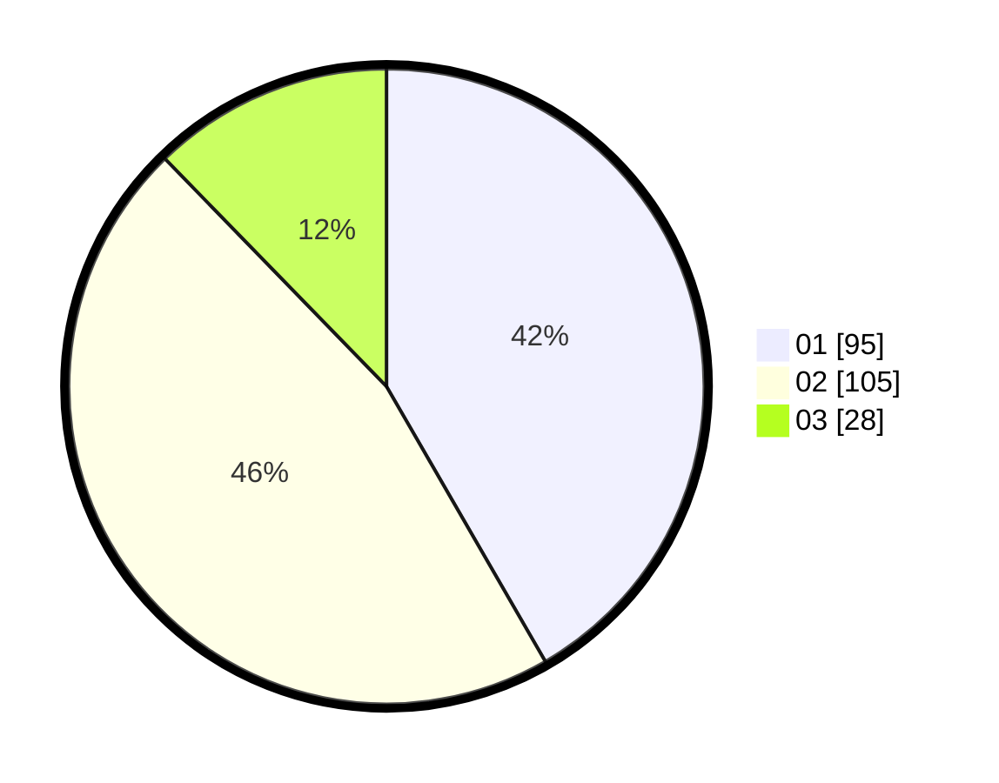

# Hasil

Hasil perolehan suara paslon dapat dilihat pada file paslon-01.txt, paslon-02.txt, dan paslon-03.txt.

Jika tidak ada, artinya data tersebut belum ada pada SIREKAP.

## Perolehan Suara

 * Paslon 01: **95**.
 * Paslon 02: **105**.
 * Paslon 03: **28**.

## Foto C Plano

https://sirekap-obj-formc.kpu.go.id/6bf5/pemilu/ppwp/31/75/04/10/04/3175041004135-20240214-235026--0639db70-943a-4b8d-b885-c7e4ff7eb9a6.jpg

https://sirekap-obj-formc.kpu.go.id/6bf5/pemilu/ppwp/31/75/04/10/04/3175041004135-20240214-235056--55ba9607-6fac-40c0-9d1e-84bab813f326.jpg

https://sirekap-obj-formc.kpu.go.id/6bf5/pemilu/ppwp/31/75/04/10/04/3175041004135-20240214-235133--d013b39a-7aed-4554-a77d-3be7dc3f8478.jpg
