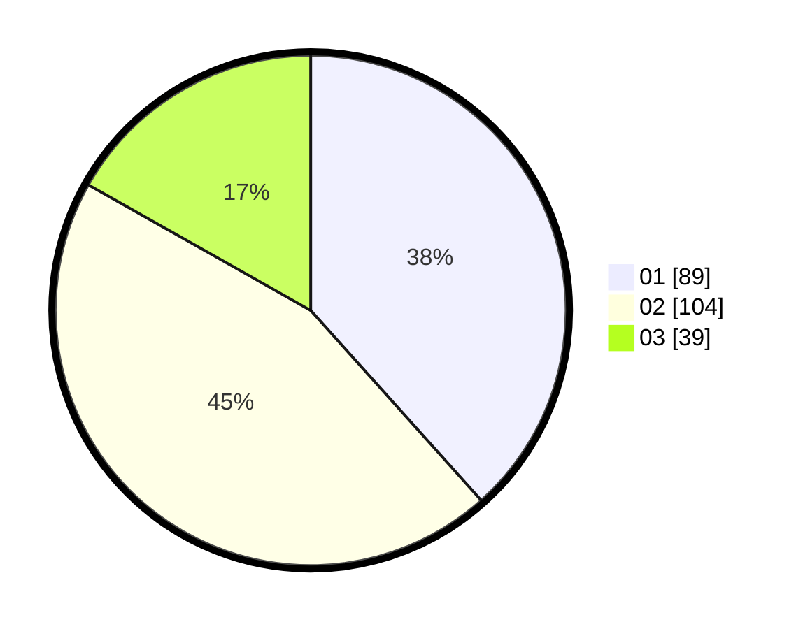

# Hasil

Hasil perolehan suara paslon dapat dilihat pada file paslon-01.txt, paslon-02.txt, dan paslon-03.txt.

Jika tidak ada, artinya data tersebut belum ada pada SIREKAP.

## Perolehan Suara

 * Paslon 01: **89**.
 * Paslon 02: **104**.
 * Paslon 03: **39**.

## Foto C Plano

https://sirekap-obj-formc.kpu.go.id/6cfe/pemilu/ppwp/31/75/04/10/04/3175041004136-20240217-084516--5536457b-fad3-4ae7-82d7-3d7a301bf84e.jpg

https://sirekap-obj-formc.kpu.go.id/6cfe/pemilu/ppwp/31/75/04/10/04/3175041004136-20240217-084610--633f2628-2861-4e30-bf47-cc36227048b6.jpg

https://sirekap-obj-formc.kpu.go.id/6cfe/pemilu/ppwp/31/75/04/10/04/3175041004136-20240217-084651--5527bbc8-d585-4a9a-8417-79bc389d8e2f.jpg

## DATA PEMILIH TETAP

Jumlah pemilih dalam DPT: **287**.
 * L: **139**.
 * P: **148**.

## DATA PENGGUNA HAK PILIH

Jumlah pengguna hak pilih dalam DPT: **230**.
 * L: **102**.
 * P: **128**.

Jumlah pengguna hak pilih dalam DPTb: **5**.
 * L: **3**.
 * P: **2**.

Jumlah pengguna hak pilih dalam DPK: **0**.
 * L: **0**.
 * P: **0**.

Jumlah pengguna hak pilih: **235**.
 * L: **105**.
 * P: **130**.

## JUMLAH SUARA SAH DAN TIDAK SAH

JUMLAH SELURUH SUARA SAH: **232**.

JUMLAH SUARA TIDAK SAH: **3**.

JUMLAH SELURUH SUARA SAH DAN SUARA TIDAK SAH: **235**.
