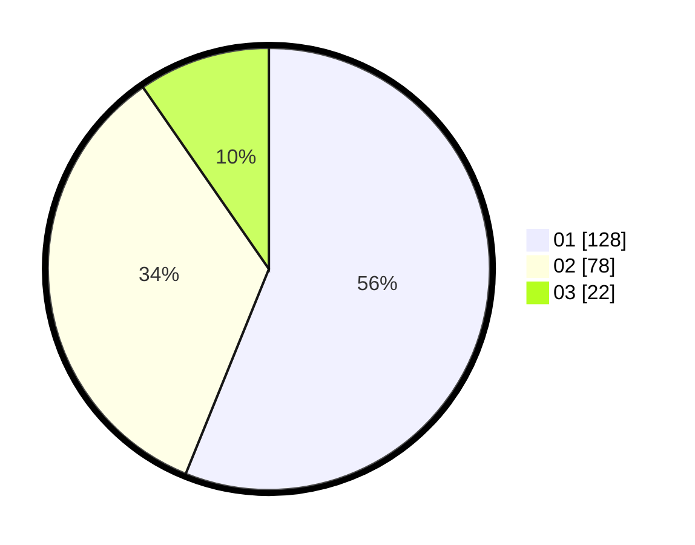

# Hasil

Hasil perolehan suara paslon dapat dilihat pada file paslon-01.txt, paslon-02.txt, dan paslon-03.txt.

Jika tidak ada, artinya data tersebut belum ada pada SIREKAP.

## Perolehan Suara

 * Paslon 01: **128**.
 * Paslon 02: **78**.
 * Paslon 03: **22**.

## Foto C Plano

https://sirekap-obj-formc.kpu.go.id/b5a8/pemilu/ppwp/31/75/04/10/04/3175041004140-20240214-210010--a8ecd247-ed4e-4aa8-aa0b-6e3c0e22ccf8.jpg

https://sirekap-obj-formc.kpu.go.id/b5a8/pemilu/ppwp/31/75/04/10/04/3175041004140-20240216-184358--4bf29b41-f4ab-4d16-a554-de246b6e0456.jpg

https://sirekap-obj-formc.kpu.go.id/b5a8/pemilu/ppwp/31/75/04/10/04/3175041004140-20240216-174512--67c7a912-0eb6-4569-958f-1d342d80e6c1.jpg

## DATA PEMILIH TETAP

Jumlah pemilih dalam DPT: **279**.
 * L: **135**.
 * P: **144**.

## DATA PENGGUNA HAK PILIH

Jumlah pengguna hak pilih dalam DPT: **225**.
 * L: **111**.
 * P: **114**.

Jumlah pengguna hak pilih dalam DPTb: **1**.
 * L: **0**.
 * P: **1**.

Jumlah pengguna hak pilih dalam DPK: **4**.
 * L: **0**.
 * P: **4**.

Jumlah pengguna hak pilih: **230**.
 * L: **111**.
 * P: **119**.

## JUMLAH SUARA SAH DAN TIDAK SAH

JUMLAH SELURUH SUARA SAH: **228**.

JUMLAH SUARA TIDAK SAH: **2**.

JUMLAH SELURUH SUARA SAH DAN SUARA TIDAK SAH: **230**.
