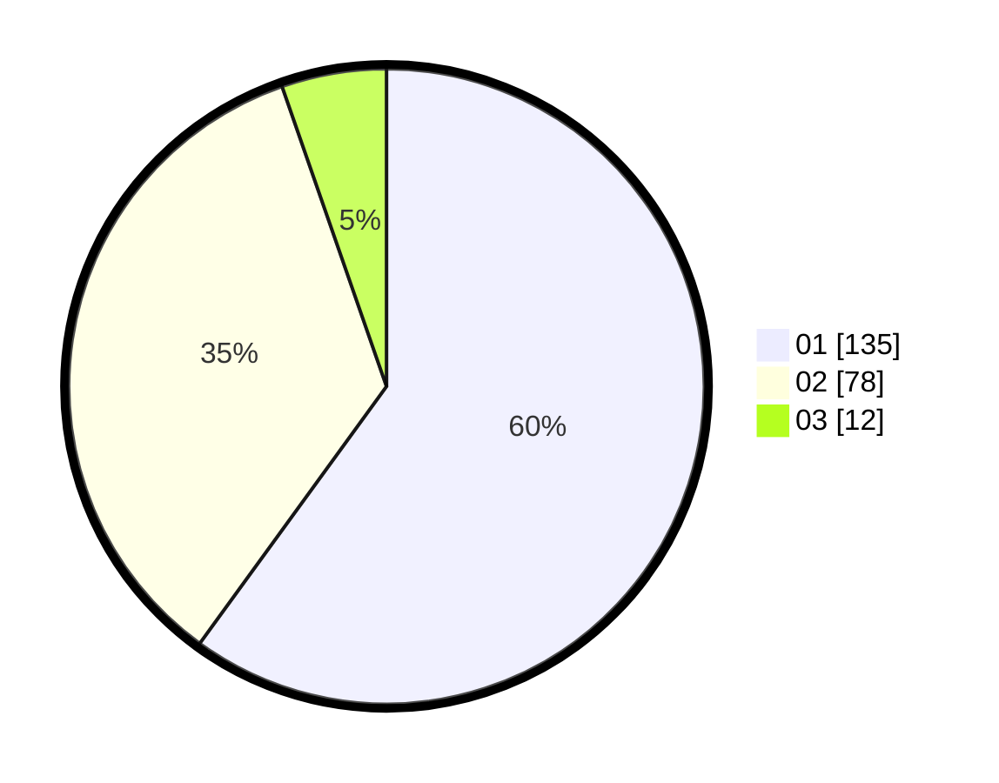

# Hasil

Hasil perolehan suara paslon dapat dilihat pada file paslon-01.txt, paslon-02.txt, dan paslon-03.txt.

Jika tidak ada, artinya data tersebut belum ada pada SIREKAP.

## Perolehan Suara

 * Paslon 01: **135**.
 * Paslon 02: **78**.
 * Paslon 03: **12**.

## Foto C Plano

https://sirekap-obj-formc.kpu.go.id/9bde/pemilu/ppwp/31/75/04/10/04/3175041004146-20240216-204427--f57d1dad-91bb-4aeb-b1ff-78ab3c0c5282.jpg

https://sirekap-obj-formc.kpu.go.id/9bde/pemilu/ppwp/31/75/04/10/04/3175041004146-20240216-205932--deba3444-67e5-490f-8244-2ae0d8cdbae8.jpg

https://sirekap-obj-formc.kpu.go.id/9bde/pemilu/ppwp/31/75/04/10/04/3175041004146-20240215-193646--8dac63d0-212f-4424-a6d0-8cebd23af3ad.jpg

## DATA PEMILIH TETAP

Jumlah pemilih dalam DPT: **283**.
 * L: **144**.
 * P: **139**.

## DATA PENGGUNA HAK PILIH

Jumlah pengguna hak pilih dalam DPT: **228**.
 * L: **115**.
 * P: **113**.

Jumlah pengguna hak pilih dalam DPTb: **0**.
 * L: **0**.
 * P: **0**.

Jumlah pengguna hak pilih dalam DPK: **5**.
 * L: **2**.
 * P: **3**.

Jumlah pengguna hak pilih: **233**.
 * L: **117**.
 * P: **116**.

## JUMLAH SUARA SAH DAN TIDAK SAH

JUMLAH SELURUH SUARA SAH: **226**.

JUMLAH SUARA TIDAK SAH: **7**.

JUMLAH SELURUH SUARA SAH DAN SUARA TIDAK SAH: **233**.
