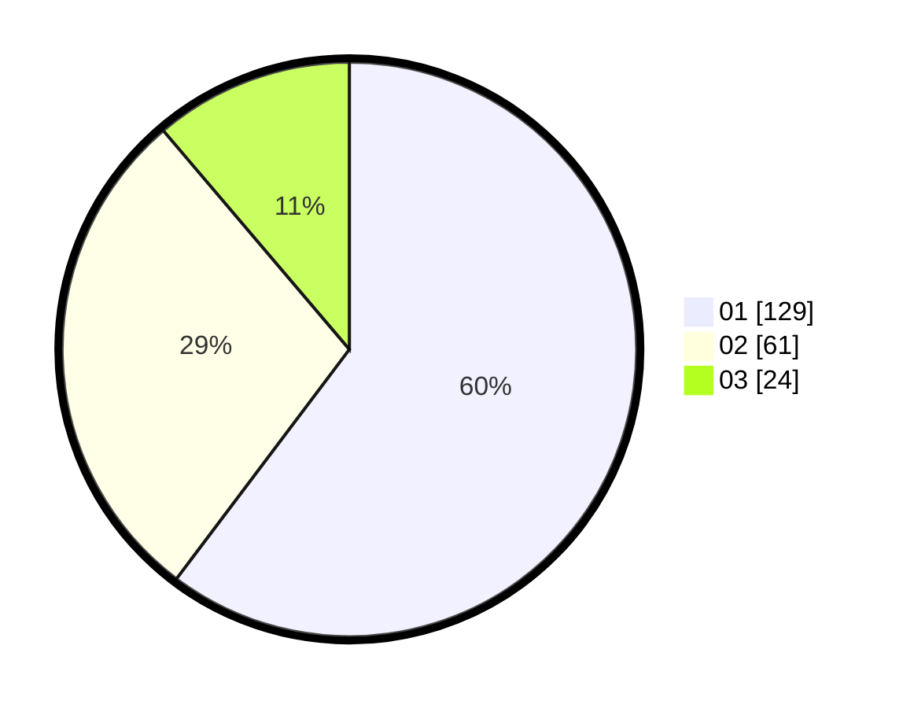

# Hasil

Hasil perolehan suara paslon dapat dilihat pada file paslon-01.txt, paslon-02.txt, dan paslon-03.txt.

Jika tidak ada, artinya data tersebut belum ada pada SIREKAP.

## Perolehan Suara

 * Paslon 01: **129**.
 * Paslon 02: **61**.
 * Paslon 03: **24**.

## Foto C Plano

https://sirekap-obj-formc.kpu.go.id/a40d/pemilu/ppwp/31/75/04/10/04/3175041004155-20240215-002918--8bc76f8f-6fb9-4e3f-9384-cc2d06258708.jpg

https://sirekap-obj-formc.kpu.go.id/a40d/pemilu/ppwp/31/75/04/10/04/3175041004155-20240215-004156--8ed26fde-0129-4890-a36a-301c7c6530e2.jpg
