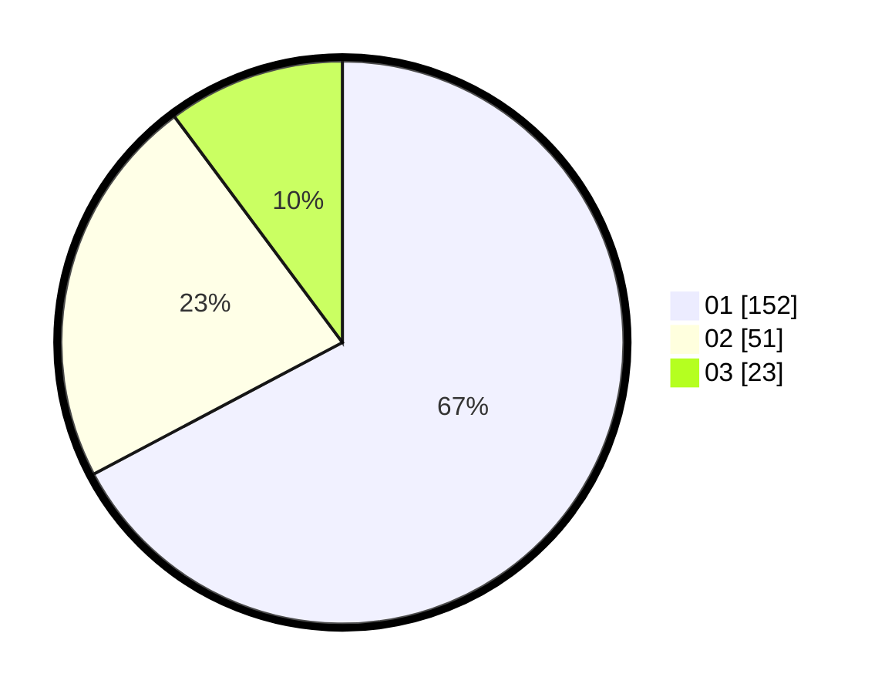

# Hasil

Hasil perolehan suara paslon dapat dilihat pada file paslon-01.txt, paslon-02.txt, dan paslon-03.txt.

Jika tidak ada, artinya data tersebut belum ada pada SIREKAP.

## Perolehan Suara

 * Paslon 01: **152**.
 * Paslon 02: **51**.
 * Paslon 03: **23**.

## Foto C Plano

https://sirekap-obj-formc.kpu.go.id/e790/pemilu/ppwp/31/75/04/10/04/3175041004157-20240215-034832--25e481fd-eb98-48f3-89c9-1693d3ce136f.jpg

https://sirekap-obj-formc.kpu.go.id/e790/pemilu/ppwp/31/75/04/10/04/3175041004157-20240215-034942--795f3525-857d-4268-a8e9-d60ae9f6686a.jpg

https://sirekap-obj-formc.kpu.go.id/e790/pemilu/ppwp/31/75/04/10/04/3175041004157-20240215-035123--6def8cb0-a160-4f4c-b202-cb4f3539fb6e.jpg

## DATA PEMILIH TETAP

Jumlah pemilih dalam DPT: **277**.
 * L: **146**.
 * P: **131**.

## DATA PENGGUNA HAK PILIH

Jumlah pengguna hak pilih dalam DPT: **218**.
 * L: **110**.
 * P: **108**.

Jumlah pengguna hak pilih dalam DPTb: **3**.
 * L: **2**.
 * P: **1**.

Jumlah pengguna hak pilih dalam DPK: **6**.
 * L: **2**.
 * P: **4**.

Jumlah pengguna hak pilih: **227**.
 * L: **114**.
 * P: **113**.

## JUMLAH SUARA SAH DAN TIDAK SAH

JUMLAH SELURUH SUARA SAH: **226**.

JUMLAH SUARA TIDAK SAH: **1**.

JUMLAH SELURUH SUARA SAH DAN SUARA TIDAK SAH: **227**.
