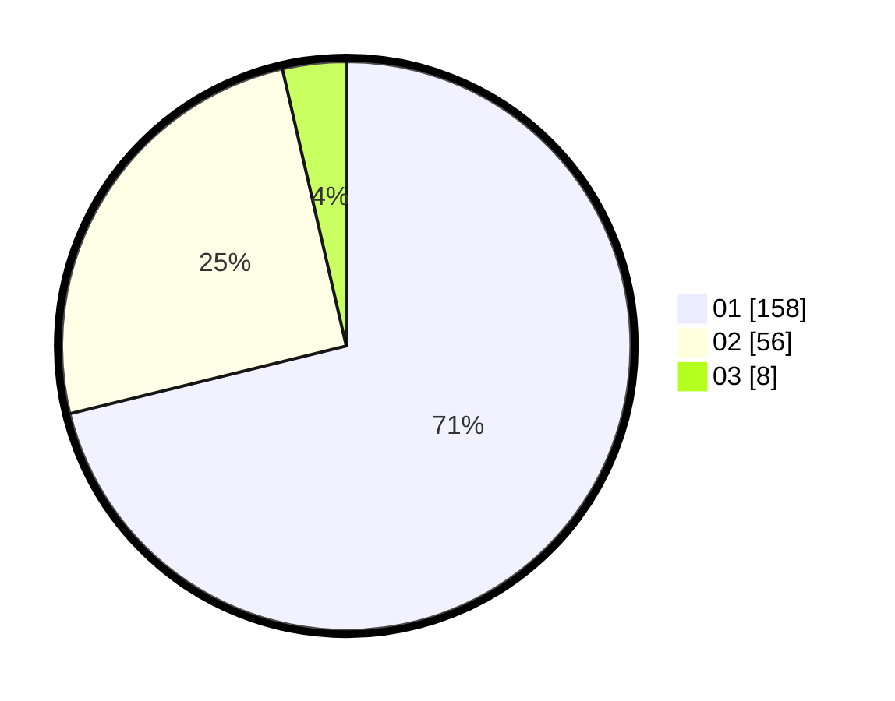

# Hasil

Hasil perolehan suara paslon dapat dilihat pada file paslon-01.txt, paslon-02.txt, dan paslon-03.txt.

Jika tidak ada, artinya data tersebut belum ada pada SIREKAP.

## Perolehan Suara

 * Paslon 01: **158**.
 * Paslon 02: **56**.
 * Paslon 03: **8**.

## Foto C Plano

https://sirekap-obj-formc.kpu.go.id/03ef/pemilu/ppwp/31/75/04/10/04/3175041004159-20240215-004223--bb525871-f0a1-4e38-87cc-bf0f7c75555d.jpg

https://sirekap-obj-formc.kpu.go.id/03ef/pemilu/ppwp/31/75/04/10/04/3175041004159-20240215-004317--6cfd6d0c-998d-446b-aab2-408760cb3ace.jpg

https://sirekap-obj-formc.kpu.go.id/03ef/pemilu/ppwp/31/75/04/10/04/3175041004159-20240215-004420--2ff5fcb0-73dc-4e1c-aa43-4c00ed8520e1.jpg
