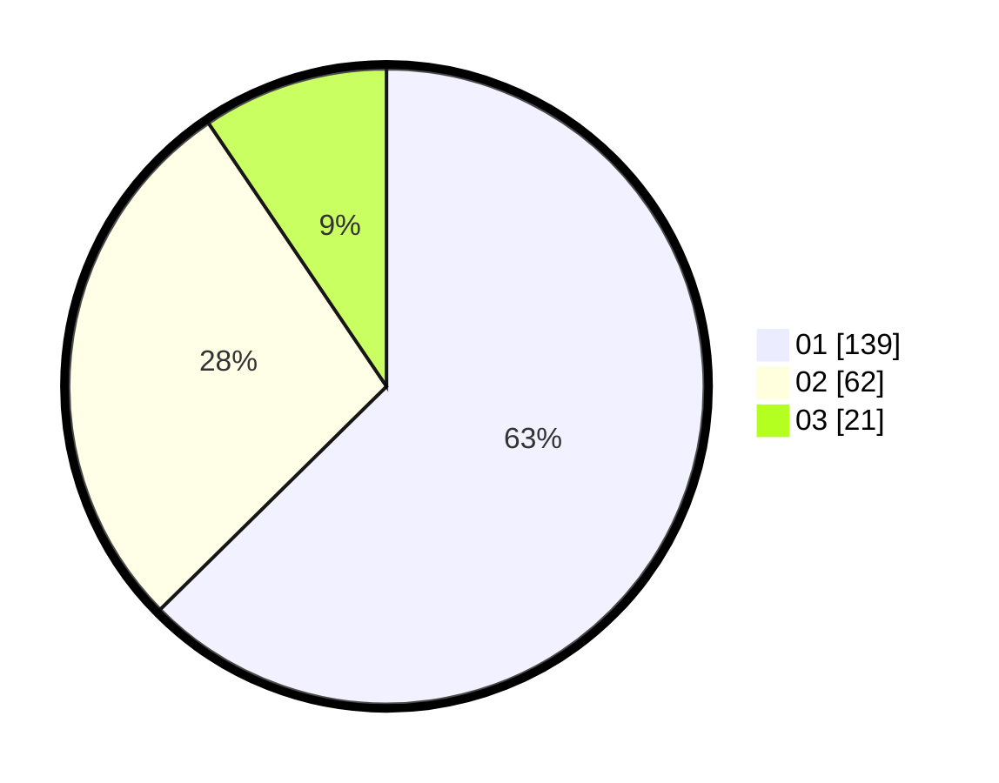

# Hasil

Hasil perolehan suara paslon dapat dilihat pada file paslon-01.txt, paslon-02.txt, dan paslon-03.txt.

Jika tidak ada, artinya data tersebut belum ada pada SIREKAP.

## Perolehan Suara

 * Paslon 01: **139**.
 * Paslon 02: **62**.
 * Paslon 03: **21**.

## Foto C Plano

https://sirekap-obj-formc.kpu.go.id/7167/pemilu/ppwp/31/75/04/10/04/3175041004160-20240215-012708--c85f7969-3165-4b82-a452-e576edd11604.jpg

https://sirekap-obj-formc.kpu.go.id/7167/pemilu/ppwp/31/75/04/10/04/3175041004160-20240214-202510--0819630b-d5fe-4e18-9b9f-9a22560c9839.jpg

https://sirekap-obj-formc.kpu.go.id/7167/pemilu/ppwp/31/75/04/10/04/3175041004160-20240214-202808--251c50b9-527b-4a6c-ad14-dcd41beabd87.jpg
