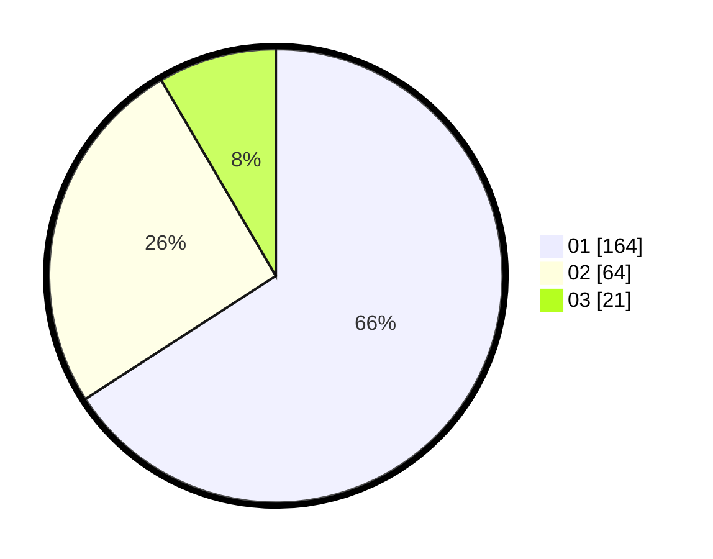

# Hasil

Hasil perolehan suara paslon dapat dilihat pada file paslon-01.txt, paslon-02.txt, dan paslon-03.txt.

Jika tidak ada, artinya data tersebut belum ada pada SIREKAP.

## Perolehan Suara

 * Paslon 01: **164**.
 * Paslon 02: **64**.
 * Paslon 03: **21**.

## Foto C Plano

https://sirekap-obj-formc.kpu.go.id/d32b/pemilu/ppwp/31/75/04/10/05/3175041005004-20240214-220554--3c3e3320-4d53-407b-98fe-55b5dab46f6e.jpg

https://sirekap-obj-formc.kpu.go.id/d32b/pemilu/ppwp/31/75/04/10/05/3175041005004-20240214-220657--c9014e84-88f3-4f85-9d30-217d66ff6d72.jpg

https://sirekap-obj-formc.kpu.go.id/d32b/pemilu/ppwp/31/75/04/10/05/3175041005004-20240214-220744--ea8babf2-605c-46a3-8681-0bf460371e72.jpg
