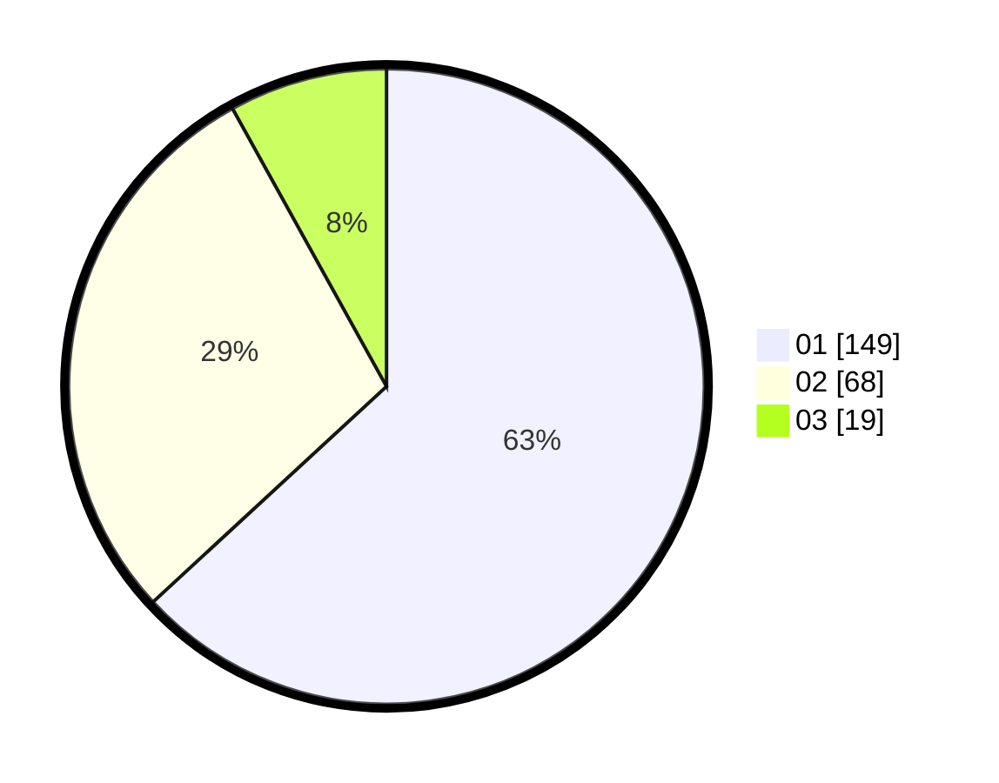

# Hasil

Hasil perolehan suara paslon dapat dilihat pada file paslon-01.txt, paslon-02.txt, dan paslon-03.txt.

Jika tidak ada, artinya data tersebut belum ada pada SIREKAP.

## Perolehan Suara

 * Paslon 01: **149**.
 * Paslon 02: **68**.
 * Paslon 03: **19**.

## Foto C Plano

https://sirekap-obj-formc.kpu.go.id/d007/pemilu/ppwp/31/75/04/10/05/3175041005005-20240214-214603--fc8f2a2b-cdf3-49bf-a0c1-ff7da79d431f.jpg

https://sirekap-obj-formc.kpu.go.id/d007/pemilu/ppwp/31/75/04/10/05/3175041005005-20240214-192209--fa5a57a1-e2cd-4ce1-8710-a54aaf9c9a79.jpg

https://sirekap-obj-formc.kpu.go.id/d007/pemilu/ppwp/31/75/04/10/05/3175041005005-20240214-192329--0fb3590b-e739-4097-96af-dfede61cd892.jpg
