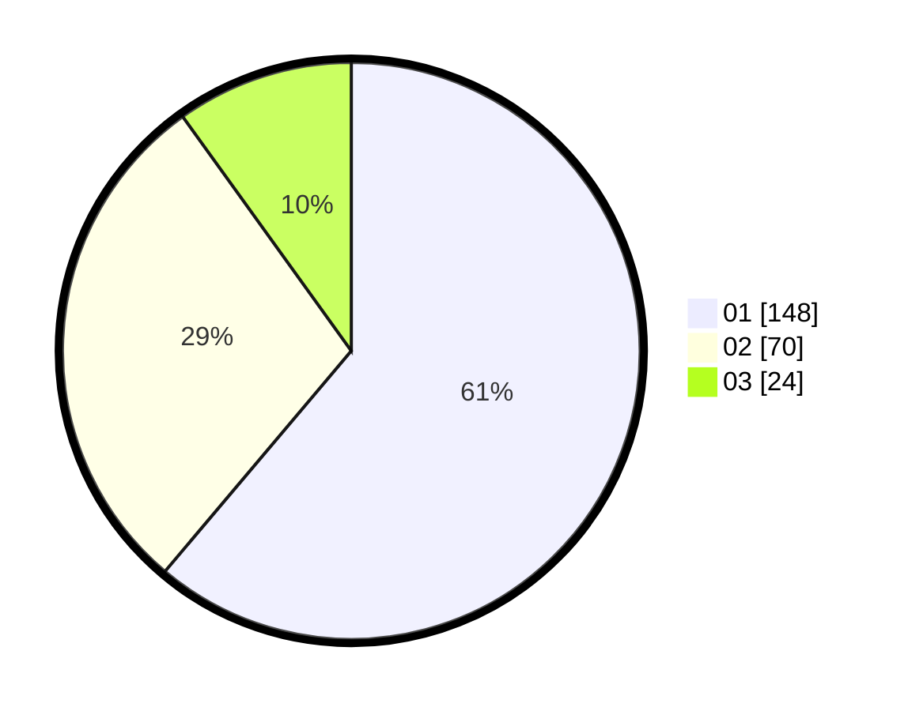

# Hasil

Hasil perolehan suara paslon dapat dilihat pada file paslon-01.txt, paslon-02.txt, dan paslon-03.txt.

Jika tidak ada, artinya data tersebut belum ada pada SIREKAP.

## Perolehan Suara

 * Paslon 01: **148**.
 * Paslon 02: **70**.
 * Paslon 03: **24**.

## Foto C Plano

https://sirekap-obj-formc.kpu.go.id/c4e4/pemilu/ppwp/31/75/04/10/05/3175041005008-20240214-193559--bb2fd670-b6a6-49b6-8c4e-33f8adf87f30.jpg

https://sirekap-obj-formc.kpu.go.id/c4e4/pemilu/ppwp/31/75/04/10/05/3175041005008-20240214-193606--8dc15a82-6626-44f3-a6bd-28cb54d24f83.jpg

https://sirekap-obj-formc.kpu.go.id/c4e4/pemilu/ppwp/31/75/04/10/05/3175041005008-20240214-193611--f35b6607-082f-4b20-890d-4a0f032f05c1.jpg
