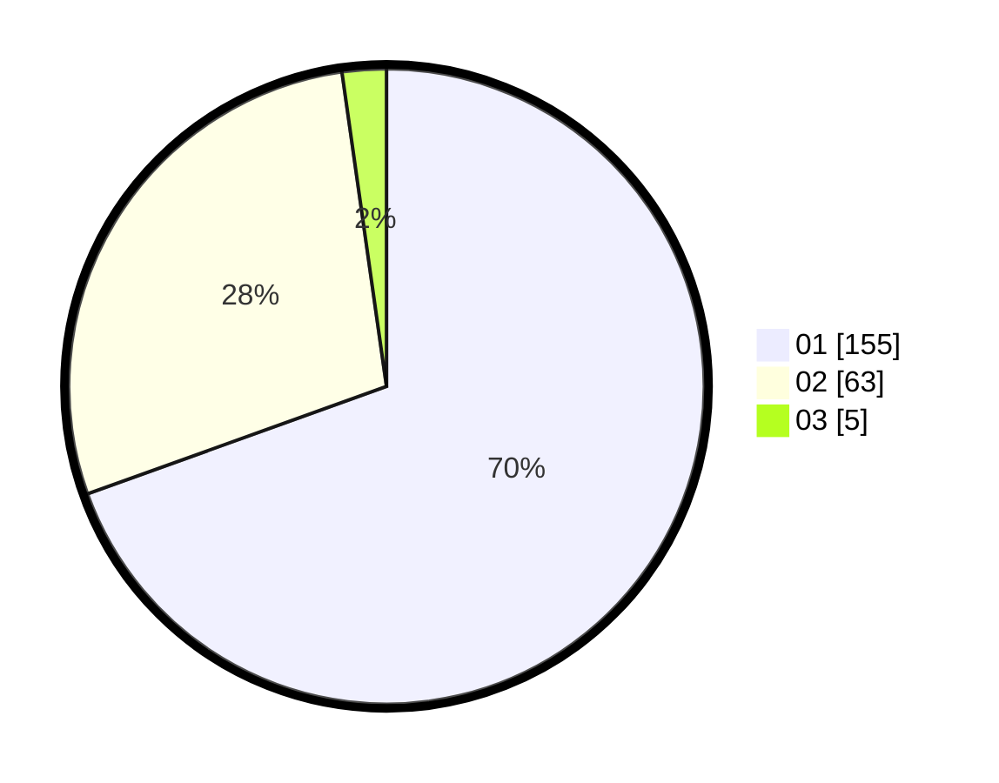

# Hasil

Hasil perolehan suara paslon dapat dilihat pada file paslon-01.txt, paslon-02.txt, dan paslon-03.txt.

Jika tidak ada, artinya data tersebut belum ada pada SIREKAP.

## Perolehan Suara

 * Paslon 01: **155**.
 * Paslon 02: **63**.
 * Paslon 03: **5**.

## Foto C Plano

https://sirekap-obj-formc.kpu.go.id/d694/pemilu/ppwp/31/75/04/10/05/3175041005009-20240214-155324--9996389a-31b6-40af-9bdb-df03679e06d9.jpg

https://sirekap-obj-formc.kpu.go.id/d694/pemilu/ppwp/31/75/04/10/05/3175041005009-20240214-200426--2a76abbd-5bae-4116-adae-4dc83d815a53.jpg

https://sirekap-obj-formc.kpu.go.id/d694/pemilu/ppwp/31/75/04/10/05/3175041005009-20240214-190800--a006b488-7086-4fb2-829a-e4c3fb639300.jpg

## DATA PEMILIH TETAP

Jumlah pemilih dalam DPT: **282**.
 * L: **141**.
 * P: **141**.

## DATA PENGGUNA HAK PILIH

Jumlah pengguna hak pilih dalam DPT: **223**.
 * L: **109**.
 * P: **114**.

Jumlah pengguna hak pilih dalam DPTb: **1**.
 * L: **1**.
 * P: **0**.

Jumlah pengguna hak pilih dalam DPK: **0**.
 * L: **0**.
 * P: **0**.

Jumlah pengguna hak pilih: **224**.
 * L: **110**.
 * P: **114**.

## JUMLAH SUARA SAH DAN TIDAK SAH

JUMLAH SELURUH SUARA SAH: **223**.

JUMLAH SUARA TIDAK SAH: **1**.

JUMLAH SELURUH SUARA SAH DAN SUARA TIDAK SAH: **224**.
