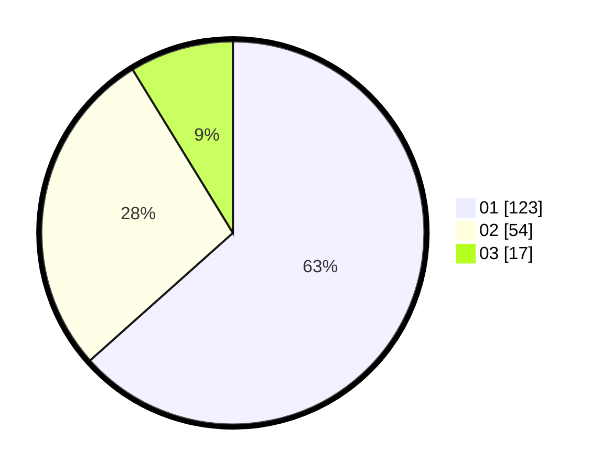

# Hasil

Hasil perolehan suara paslon dapat dilihat pada file paslon-01.txt, paslon-02.txt, dan paslon-03.txt.

Jika tidak ada, artinya data tersebut belum ada pada SIREKAP.

## Perolehan Suara

 * Paslon 01: **123**.
 * Paslon 02: **54**.
 * Paslon 03: **17**.

## Foto C Plano

https://sirekap-obj-formc.kpu.go.id/c902/pemilu/ppwp/31/75/04/10/05/3175041005010-20240214-234619--d2731385-eb7f-48b6-948f-30b91171874b.jpg

https://sirekap-obj-formc.kpu.go.id/c902/pemilu/ppwp/31/75/04/10/05/3175041005010-20240214-234719--ef92e731-a726-4230-a4c5-e6a3062b9054.jpg

https://sirekap-obj-formc.kpu.go.id/c902/pemilu/ppwp/31/75/04/10/05/3175041005010-20240214-234815--a382fd02-bf68-4f11-bb3e-f40a71bd8146.jpg
