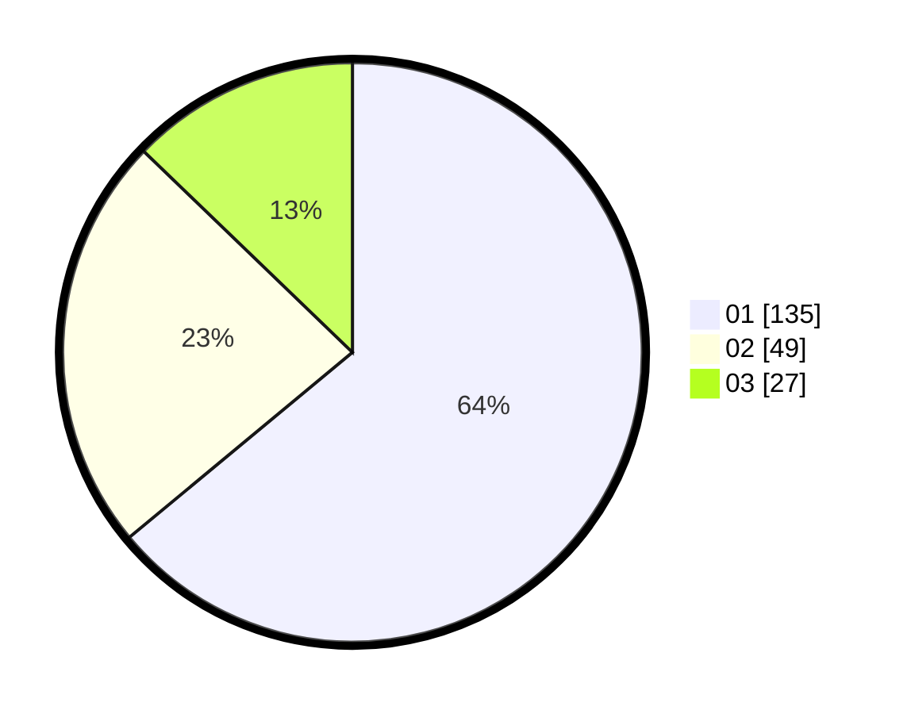

# Hasil

Hasil perolehan suara paslon dapat dilihat pada file paslon-01.txt, paslon-02.txt, dan paslon-03.txt.

Jika tidak ada, artinya data tersebut belum ada pada SIREKAP.

## Perolehan Suara

 * Paslon 01: **135**.
 * Paslon 02: **49**.
 * Paslon 03: **27**.

## Foto C Plano

https://sirekap-obj-formc.kpu.go.id/694c/pemilu/ppwp/31/75/04/10/05/3175041005011-20240214-231533--9b652446-36f3-45fe-a0d8-8e9c8e84fad0.jpg

https://sirekap-obj-formc.kpu.go.id/694c/pemilu/ppwp/31/75/04/10/05/3175041005011-20240214-231632--e2dad9c5-7104-4e66-9cec-54ed061f4aab.jpg

https://sirekap-obj-formc.kpu.go.id/694c/pemilu/ppwp/31/75/04/10/05/3175041005011-20240214-231754--4e73e449-ff33-41b6-b0e5-59ee36eb3539.jpg

## DATA PEMILIH TETAP

Jumlah pemilih dalam DPT: **264**.
 * L: **134**.
 * P: **130**.

## DATA PENGGUNA HAK PILIH

Jumlah pengguna hak pilih dalam DPT: **211**.
 * L: **100**.
 * P: **111**.

Jumlah pengguna hak pilih dalam DPTb: **1**.
 * L: **0**.
 * P: **1**.

Jumlah pengguna hak pilih dalam DPK: **2**.
 * L: **0**.
 * P: **2**.

Jumlah pengguna hak pilih: **214**.
 * L: **100**.
 * P: **114**.

## JUMLAH SUARA SAH DAN TIDAK SAH

JUMLAH SELURUH SUARA SAH: **211**.

JUMLAH SUARA TIDAK SAH: **3**.

JUMLAH SELURUH SUARA SAH DAN SUARA TIDAK SAH: **214**.
