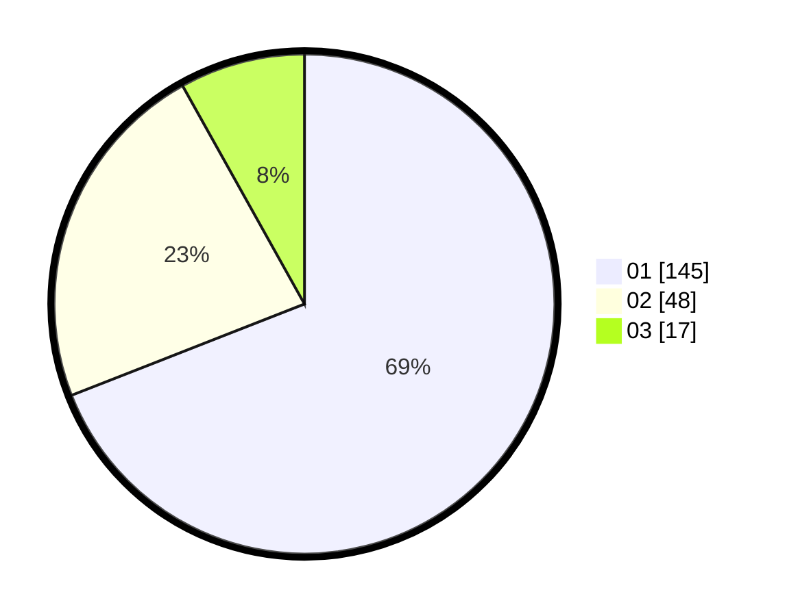

# Hasil

Hasil perolehan suara paslon dapat dilihat pada file paslon-01.txt, paslon-02.txt, dan paslon-03.txt.

Jika tidak ada, artinya data tersebut belum ada pada SIREKAP.

## Perolehan Suara

 * Paslon 01: **145**.
 * Paslon 02: **48**.
 * Paslon 03: **17**.

## Foto C Plano

https://sirekap-obj-formc.kpu.go.id/e76b/pemilu/ppwp/31/75/04/10/05/3175041005012-20240214-222628--278bd47a-afcc-423b-ad54-117602acfe2b.jpg

https://sirekap-obj-formc.kpu.go.id/e76b/pemilu/ppwp/31/75/04/10/05/3175041005012-20240214-222747--fe4dcf63-4be6-40fb-9697-632a0a0d6d6a.jpg

https://sirekap-obj-formc.kpu.go.id/e76b/pemilu/ppwp/31/75/04/10/05/3175041005012-20240214-222826--8a6227b4-e6d1-4b84-ad7a-15eb56c4bd73.jpg
