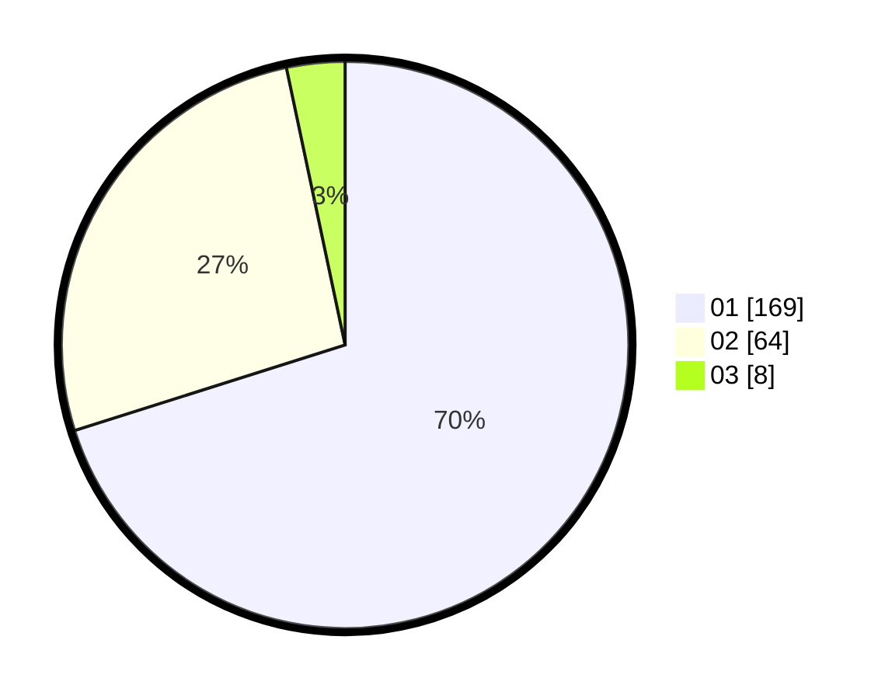

# Hasil

Hasil perolehan suara paslon dapat dilihat pada file paslon-01.txt, paslon-02.txt, dan paslon-03.txt.

Jika tidak ada, artinya data tersebut belum ada pada SIREKAP.

## Perolehan Suara

 * Paslon 01: **169**.
 * Paslon 02: **64**.
 * Paslon 03: **8**.

## Foto C Plano

https://sirekap-obj-formc.kpu.go.id/bb65/pemilu/ppwp/31/75/04/10/05/3175041005013-20240216-004746--04a51fdc-0374-4949-8ead-004a3587efea.jpg

https://sirekap-obj-formc.kpu.go.id/bb65/pemilu/ppwp/31/75/04/10/05/3175041005013-20240216-004754--682a42c2-39df-40c7-b1f4-1da32d0ca697.jpg

https://sirekap-obj-formc.kpu.go.id/bb65/pemilu/ppwp/31/75/04/10/05/3175041005013-20240216-004749--a563abcf-cd69-4d2c-817c-2ee759ab5d1f.jpg

## DATA PEMILIH TETAP

Jumlah pemilih dalam DPT: **295**.
 * L: **145**.
 * P: **150**.

## DATA PENGGUNA HAK PILIH

Jumlah pengguna hak pilih dalam DPT: **238**.
 * L: **114**.
 * P: **124**.

Jumlah pengguna hak pilih dalam DPTb: **7**.
 * L: **4**.
 * P: **3**.

Jumlah pengguna hak pilih dalam DPK: **0**.
 * L: **0**.
 * P: **0**.

Jumlah pengguna hak pilih: **245**.
 * L: **118**.
 * P: **127**.

## JUMLAH SUARA SAH DAN TIDAK SAH

JUMLAH SELURUH SUARA SAH: **241**.

JUMLAH SUARA TIDAK SAH: **4**.

JUMLAH SELURUH SUARA SAH DAN SUARA TIDAK SAH: **245**.
