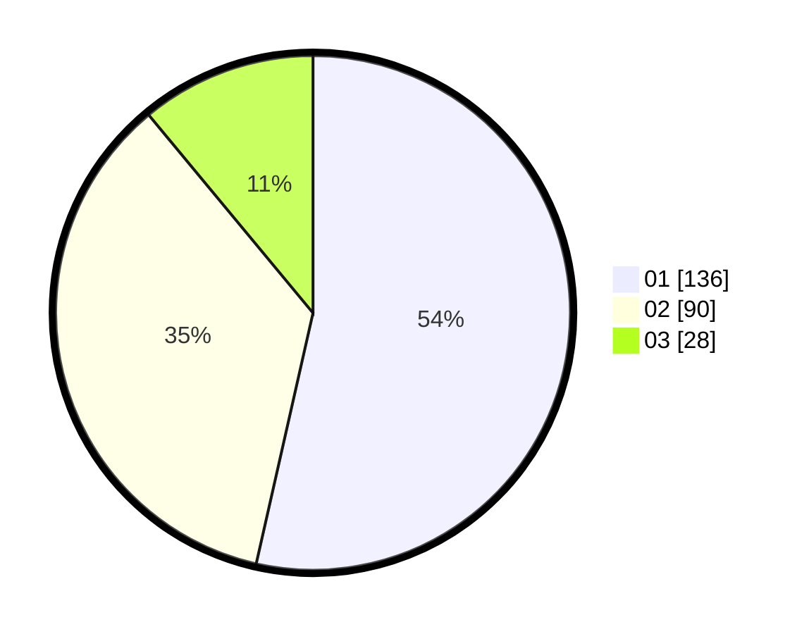

# Hasil

Hasil perolehan suara paslon dapat dilihat pada file paslon-01.txt, paslon-02.txt, dan paslon-03.txt.

Jika tidak ada, artinya data tersebut belum ada pada SIREKAP.

## Perolehan Suara

 * Paslon 01: **136**.
 * Paslon 02: **90**.
 * Paslon 03: **28**.

## Foto C Plano

https://sirekap-obj-formc.kpu.go.id/5d12/pemilu/ppwp/31/75/04/10/05/3175041005020-20240214-211759--cb7e0d13-6c93-41df-80d0-dc0904a6737a.jpg

https://sirekap-obj-formc.kpu.go.id/5d12/pemilu/ppwp/31/75/04/10/05/3175041005020-20240216-234846--2ce12fe1-7709-4b3b-b13d-fbddd73dde7b.jpg

https://sirekap-obj-formc.kpu.go.id/5d12/pemilu/ppwp/31/75/04/10/05/3175041005020-20240214-192309--f094a015-56b9-4537-97fc-0e970e693104.jpg

## DATA PEMILIH TETAP

Jumlah pemilih dalam DPT: **289**.
 * L: **146**.
 * P: **143**.

## DATA PENGGUNA HAK PILIH

Jumlah pengguna hak pilih dalam DPT: **241**.
 * L: **124**.
 * P: **117**.

Jumlah pengguna hak pilih dalam DPTb: **10**.
 * L: **6**.
 * P: **4**.

Jumlah pengguna hak pilih dalam DPK: **5**.
 * L: **2**.
 * P: **3**.

Jumlah pengguna hak pilih: **256**.
 * L: **132**.
 * P: **124**.

## JUMLAH SUARA SAH DAN TIDAK SAH

JUMLAH SELURUH SUARA SAH: **254**.

JUMLAH SUARA TIDAK SAH: **2**.

JUMLAH SELURUH SUARA SAH DAN SUARA TIDAK SAH: **256**.
