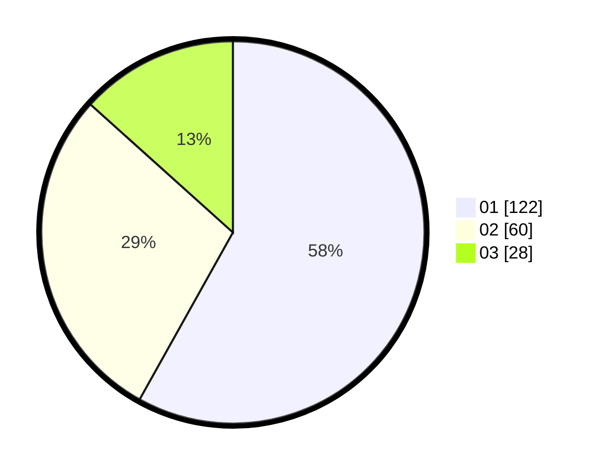

# Hasil

Hasil perolehan suara paslon dapat dilihat pada file paslon-01.txt, paslon-02.txt, dan paslon-03.txt.

Jika tidak ada, artinya data tersebut belum ada pada SIREKAP.

## Perolehan Suara

 * Paslon 01: **122**.
 * Paslon 02: **60**.
 * Paslon 03: **28**.

## Foto C Plano

https://sirekap-obj-formc.kpu.go.id/97e3/pemilu/ppwp/31/75/04/10/05/3175041005023-20240216-130639--649432cb-abde-423f-b9eb-6b1b813b3583.jpg

https://sirekap-obj-formc.kpu.go.id/97e3/pemilu/ppwp/31/75/04/10/05/3175041005023-20240216-130804--1a451f2a-ee07-4d45-a390-c9331459ec89.jpg

https://sirekap-obj-formc.kpu.go.id/97e3/pemilu/ppwp/31/75/04/10/05/3175041005023-20240215-004409--8d4bc0c4-17e8-4568-b749-27493f578afc.jpg
