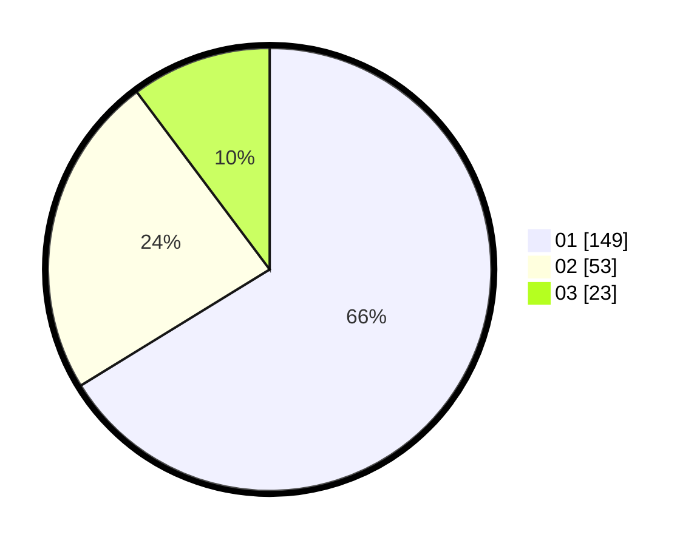

# Hasil

Hasil perolehan suara paslon dapat dilihat pada file paslon-01.txt, paslon-02.txt, dan paslon-03.txt.

Jika tidak ada, artinya data tersebut belum ada pada SIREKAP.

## Perolehan Suara

 * Paslon 01: **149**.
 * Paslon 02: **53**.
 * Paslon 03: **23**.

## Foto C Plano

https://sirekap-obj-formc.kpu.go.id/23b3/pemilu/ppwp/31/75/04/10/05/3175041005024-20240214-222706--66de706e-f7c4-4431-8394-3af05a1b172f.jpg

https://sirekap-obj-formc.kpu.go.id/23b3/pemilu/ppwp/31/75/04/10/05/3175041005024-20240214-222850--f1a0fd8a-9cff-46d8-a4ce-ccb605083ada.jpg
