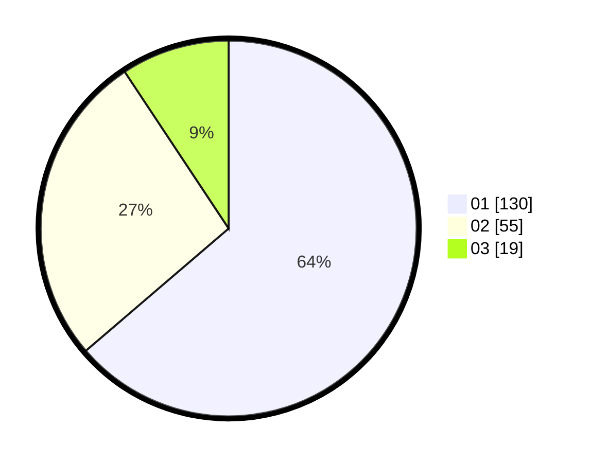

# Hasil

Hasil perolehan suara paslon dapat dilihat pada file paslon-01.txt, paslon-02.txt, dan paslon-03.txt.

Jika tidak ada, artinya data tersebut belum ada pada SIREKAP.

## Perolehan Suara

 * Paslon 01: **130**.
 * Paslon 02: **55**.
 * Paslon 03: **19**.

## Foto C Plano

https://sirekap-obj-formc.kpu.go.id/6fac/pemilu/ppwp/31/75/04/10/05/3175041005026-20240215-031105--44a79893-4ef4-4898-bb9b-9ecd98445642.jpg

https://sirekap-obj-formc.kpu.go.id/6fac/pemilu/ppwp/31/75/04/10/05/3175041005026-20240215-031211--3b8d1ffd-58c0-4b8f-855d-47816ae9c852.jpg

https://sirekap-obj-formc.kpu.go.id/6fac/pemilu/ppwp/31/75/04/10/05/3175041005026-20240215-031308--111a57dc-badf-458e-9516-f2afe5bb445e.jpg
