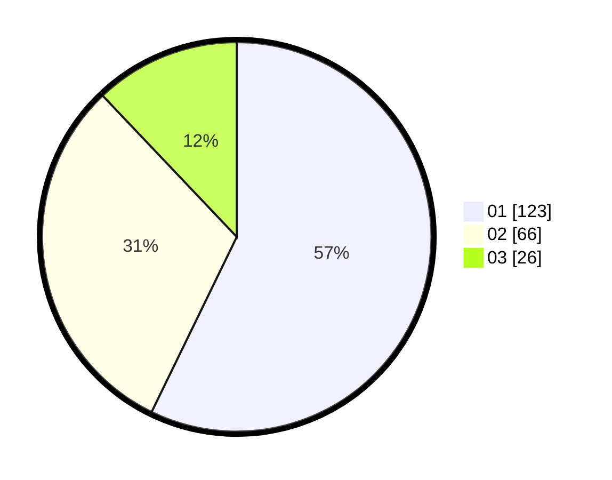

# Hasil

Hasil perolehan suara paslon dapat dilihat pada file paslon-01.txt, paslon-02.txt, dan paslon-03.txt.

Jika tidak ada, artinya data tersebut belum ada pada SIREKAP.

## Perolehan Suara

 * Paslon 01: **123**.
 * Paslon 02: **66**.
 * Paslon 03: **26**.

## Foto C Plano

https://sirekap-obj-formc.kpu.go.id/331a/pemilu/ppwp/31/75/04/10/05/3175041005030-20240214-222913--cabb5955-1298-47be-b213-8884b1a81517.jpg

https://sirekap-obj-formc.kpu.go.id/331a/pemilu/ppwp/31/75/04/10/05/3175041005030-20240215-042351--45d4a3aa-37cb-4c3b-a49b-3ff074525cb7.jpg

https://sirekap-obj-formc.kpu.go.id/331a/pemilu/ppwp/31/75/04/10/05/3175041005030-20240214-213110--a0cedc12-ef50-4ed5-8f2f-677ac4592d14.jpg
