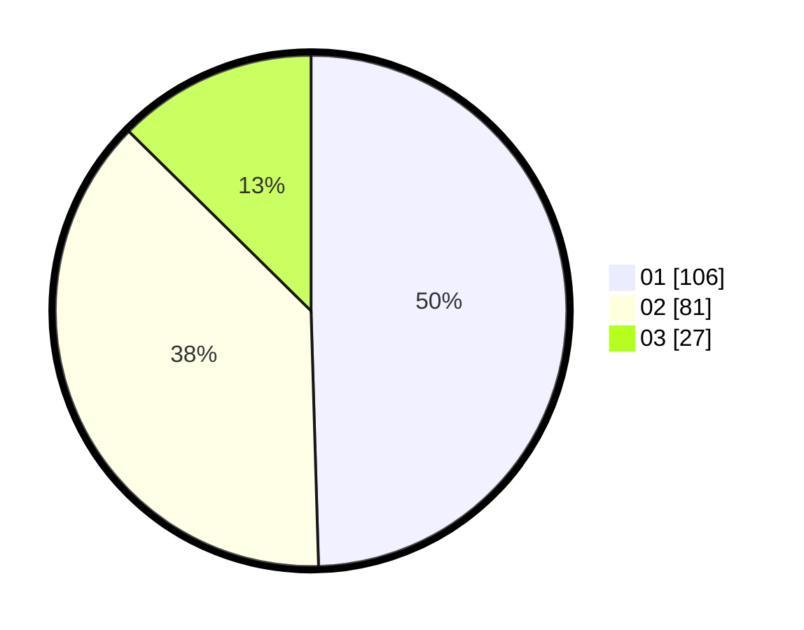

# Hasil

Hasil perolehan suara paslon dapat dilihat pada file paslon-01.txt, paslon-02.txt, dan paslon-03.txt.

Jika tidak ada, artinya data tersebut belum ada pada SIREKAP.

## Perolehan Suara

 * Paslon 01: **106**.
 * Paslon 02: **81**.
 * Paslon 03: **27**.

## Foto C Plano

https://sirekap-obj-formc.kpu.go.id/1f24/pemilu/ppwp/31/75/04/10/05/3175041005031-20240214-222422--62a478f8-26e2-480d-a8d0-6e80cb340914.jpg

https://sirekap-obj-formc.kpu.go.id/1f24/pemilu/ppwp/31/75/04/10/05/3175041005031-20240214-222804--ea17c591-4251-46ef-9214-01478ce80446.jpg

https://sirekap-obj-formc.kpu.go.id/1f24/pemilu/ppwp/31/75/04/10/05/3175041005031-20240214-223102--09c72a90-950d-44fb-8fd2-4d192d49addd.jpg
